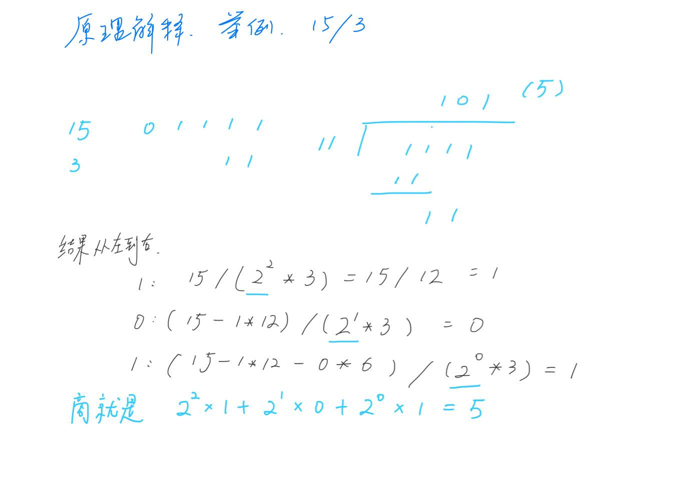

## 剑指II-001 整数除法

### 题目

**src**：https://leetcode-cn.com/problems/xoh6Oh/

#### description

<div align="center">  </div>


#### method signature

```java
public int divide(int a, int b) {
```


### solutions

#### solution 1 (brute force)

**题目要求 a 除以 b 的商，且截去小数部分，可以理解为 a 等价于 n * b + c（c 是余数），用减法来实现乘法。**

> 实现的时候要注意：
>
> 1. 是否会越界；
> 2. a, b 怎样进行减法计算，统一为`+`或`-`，计算结束之后，`returun value` 的符号；
>

**越界的讨论**，本题是整数除法（c must <= a），所以计算中溢出的情况只有一个，就是 −2^31^ / -1，它的结果 2^31^ 越界了，根据题目，需要特殊处理返回 2^31^ − 1；

* 还有一种情况，a=−2^31^，a 在转变成正数的时候，变成 2^31^，溢出了。所以，要么都变负数，要么这种特殊情况拎出来讨论。

**`returun value` 的正负号**，可以先记好 a, b 的符号，只有在它俩异号的时候商是负号（一个负数 or 一个正数），用一个变量记下，之后就可以去掉原本的正负号，进行计算；


*code*：

```java
// repalce a with dividend, replace b with divisor, for better understanding.
public int divide(int dividend, int divisor) {
    // cornor case
    if(dividend == Integer.MIN_VALUE && divisor == -1) return  Integer.MAX_VALUE;
    
    int flag = 2;
    int result = 0;
    
    // switch dividend, divisor to negative numbers to avoid cross boundary.
    // notes: Math.abs() would return wrong answer if dividend or divisor is Integer.MIN_VALUE.
    if(dividend > 0){
        flag--;
        dividend = -dividend;
    }
    if(divisor > 0){
        flag--;
        divisor = -divisor;
    }
    
    while(dividend <= divisor){
        dividend = dividend - divisor;
        result ++;
    }
    
    return flag == 1 ? -result : result;
}
```

**Pros and Cons**

| big O            | -                     |
| ---------------- | --------------------- |
| time complexity  | O(n)，n = (a - c) / b |
| space complexity | O(1)                  |

*cons*

计算量太大，最坏情况如果 a = −2^31^，b = 1，计算 a / b，需要经过很多次减法循环。

* **在 time limit exceeded 的边缘试探，难跑过。**

*pros*

思路直观。


**conclusion**

因为 Java 语言的特点，需要考虑 int 越界的因素，在结果输出和计算的时候都要考虑到这一点，是本题的难点。


#### solution 2 (bit wise & simulation)

**越界问题**，和 Solution 1 差不多的解法，先筛掉特殊情况，之后在计算过程中不用 Math.abs()；

* 如果要用Math.abs()，需要把传入的参数 a，b 强制转型为 long，再求绝对值；

**正负号问题**（bit 视角）：

* 铺垫：位运算的`异或`（不同是1）和`与`（同时为1是1），`Integer.MIN_VALUE`是负数，最高位（符号位）为`1`；

  | `Integer.MIN_VALUE` | -2147483648 | 1-0000000000000000000000000000000 |
  | ------------------- | ----------- | --------------------------------- |

* a ^ b 解释 若 a，b 同号，0xxxx，若异号，1xxxx，这时和 `Integer.MIN_VALUE` 进行与运算，除了最高位，其它位均清0，得到结果 0（ab同号） or 1（ab异号）；

* 相比于Solution 1的 flag，这个解法能体现位运算的知识储备。

**simulation 的部分**：模拟除法的手写算式（二进制），本质还是减法，但是里面的一层用二进制，这样就可以用移位运算，把时间复杂度省到 log 级别。

<div align="center">  </div>


*Code*

```java
public int divide(int a, int b) {
    // cornor case
    if(a == Integer.MIN_VALUE && b == -1) return  Integer.MAX_VALUE;
    
    int signBit = Integer.MIN_VALUE;
    
    // if a = Integer.MIN_VALUE, -a would cross int's boundary.
    long ans = 0, x = a, y = b;
    
    x = x < 0 ? -x : x;
    y = y < 0 ? -y : y;
    
    while (x >= y) {
        long cnt = 1, divisor = y;
        while (x > (divisor << 1)) {
            cnt <<= 1;
            divisor <<= 1;
        }
        ans += cnt;
        x -= divisor;
    }
    ans = (((a ^ b) & signBit) == 0) ? ans : -ans;
    return (int)ans;
}
    
```

**Pros and Cons**

| big O            | -                        |
| ---------------- | ------------------------ |
| time complexity  | O(logn)，n = (a - c) / b |
| space complexity | O(1)                     |


*cons*

针对 int 越界的问题，用了 long，但一些情况下可能会限制 long 的使用。


*pros*

**节约了时间，跑很快。**


**conclusion**

特点是移位运算，里面的一层循环要理清，算是难点。

亮点是商的正负号判断，用位运算一行代码就解决了（相比于a，b进行大于0小于0判断），但是普通方法来判断也是完全可以的。

