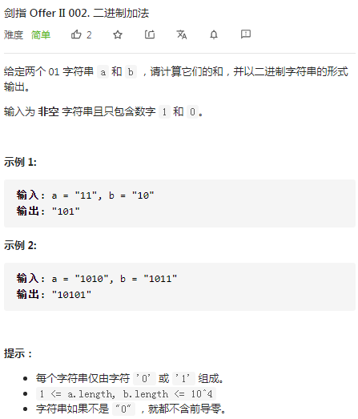

## 剑指II-002 二进制加法

### 题目

**src**：https://leetcode-cn.com/problems/JFETK5/

**题目**：



**题头**：

```java
public String addBinary(String a, String b) {
```


## Solution 1(brute force, simulation)

function实现加法，最直接的想法是传入的参数转成integer或者long，再用“+”相加，得到结果后，将结果转为String返回。但这行不通，因为即使是long类型（2^63^-1, 10^18^），长度也无法达到题目要求的10^4^。

所以用模拟竖式加法来做这道题（下图）。


* 进位carry，指针i，j来指正在计算的位，读到的数据分别存到digitA，digitB，输出结果存到StringBuilder（可变，不同步）；
* 每次的加和结果sum = digitA + digitB + carry，若sum >= 2就变0，同时carry + 1；
* 每次的sum append到输出结果result中，返回的时候reverse，最后转成String格式；

**Code**：

```java
public String addBinary(String a, String b) {
    // cornor case, in this case is not necessary to write, refer to problem describes.
    if(a == null || a.length() == 0) return b;
    if(b == null || b.length() == 0) return a;
    
    int carry = 0;
    StringBuilder result = new StringBuilder();
    int i = a.length()-1;
    int j = b.length()-1;
    while(i >= 0 || j >= 0){
        digitA = i >= 0 ? a.charAt(i--) - '0' : 0;
        digitB = j >= 0 ? b.charAt(j--) - '0' : 0;
        int sum = digitA + digitB + carry;
        carry = sum >= 2 ? 1 : 0;
        sum = sum >= 2 ? sum - 2 : sum;
        result.append(sum);
    }
    if(carry == 1) result.append(1);
    return result.reverse().toString();
}
```

**解法分析：**

| 易错点                                                       |
| ------------------------------------------------------------ |
| `i--`，先引用后减去，即先让i所在的表达式中使用i的当前值，再让i减1； |
| 进位之后，记得sum要减去对应的进位，不然sum要加到result后面就乱了； |
| 在返回结果前，记得把最后的carry加上；                        |

time complexity: O(max(M, N) )， 其中 M，N 为 2 数字长度，按位遍历一遍数字（以较长的数字为准）；

space complexity: O(1)；

想到用模拟来做之后，思路清晰，这道题目还是很好写的，没有什么难的。

