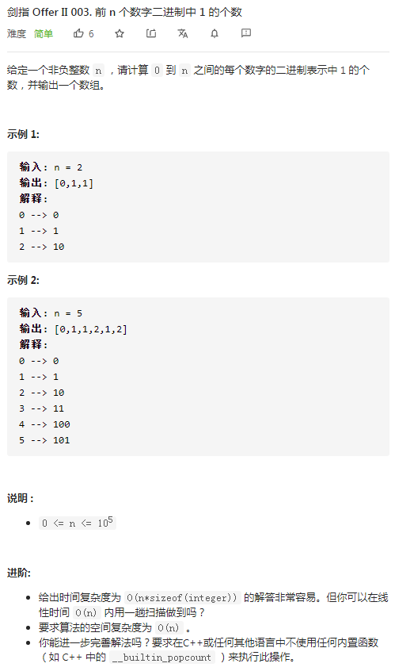

## 剑指II-003 前 n 个数字二进制中 1 的个数

### 题目

**src**：https://leetcode-cn.com/problems/w3tCBm/

**题目**：



**题头**：

```java
public int[] countBits(int n) {
```


## Solution 1(brute force, bit wise)

题目是要让我们对 0-n 间的每个数（toBinary）进行 1 的计数，初看题目容易没有思路。

* 如果一一遍历每个数会是一个大工程，time complexity会达到 O(n*sizeof(integer)) ，不可取；

* 一种较高效的方法是用位运算来数1，`i & (i-1)`，可以消去最右端的1，直到变为0，就可以得到1的个数，time complexity：O(k*n) ，假设一个数有k位；

  [^参考]: https://leetcode-cn.com/problems/w3tCBm/solution/jian-zhi-offer-2-mian-shi-ti-3-shu-zhong-sho1/

**Code**：

```java
public int[] countBits(int n) {
    int[] arr = new int[n + 1];
    for(int i = 0; i<= n; i++){
        int cur = i;
        while(cur != 0){
            arr[i]++;
            cur = cur & cur - 1;
        }
    }
    return arr;
}
```

**解法分析：**

| 易错点                                                       |
| ------------------------------------------------------------ |
| 数组的动态初始化，`int[] c = new int[3]`；                   |
| 运算符的优先级 `&` and `-` ， `-` 优先于  `&` ，所以这边`i & (i-1)`不加括号也行； |

time complexity: O(n*sizeof(integer))；

space complexity: O(1)；

想到用位运算`i & (i-1)`来数1之后，这道题目还是很好写的，没有什么难的。

## Solution 2(bit wise)

还是围绕`i & (i-1)`做文章，上面说了，它可以消去最右端的1，即`i` 比`i & (i-1)`多了一个最右边的1，举例，1110 比 1100 多一个1，也就是 14 比 12 **多一个1**。利用这点，就可以以小推大。

* 注意：不是数值大一个1，而是1的个数**多1个**。

**Code**：

```java
public int[] countBits(int n) {
    int[] arr = new int[n + 1];
    for(int i = 1; i<= n; i++){
        arr[i] = arr[i & i - 1] + 1;
    }
    return arr;
}
```

**解法分析：**

time complexity: O(n)；

space complexity: O(1)；

迭代的思想。

## Solution 3(bit shifting, bit wise)

用移位运算来文章，i 与 i >> 1存在联系。

* 如果 i 最低位为 0，即 i 为偶数，那么 i 与 i >> 1 二进制 1 的个数相同；
* 如果 i 最低位为 1，即 i 为奇数，那么 i 比 i >> 1 多一个1；

奇偶的判定：x & 1，x 为偶数，结果为0；x为奇数，结果为1；

那么，就可以列出式子：`arr[i] = arr[i>>1] + (i & 1)`；

**Code**：

```java
public int[] countBits(int n) {
    int[] arr = new int[n + 1];
    for(int i = 1; i<= n; i++){
        arr[i] = arr[i >> 1] + (i & 1);
    }
    return arr;
}
```

**解法分析：**

time complexity: O(n)；

space complexity: O(1)；

迭代的思想。
