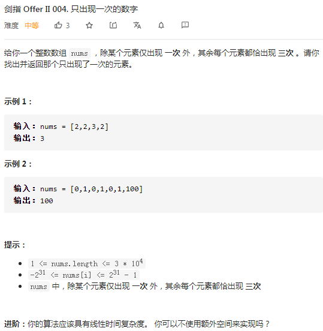

## 剑指II-004 只出现一次的数字 

### 题目

**src**：https://leetcode-cn.com/problems/WGki4K/

**题目**：



**题头**：

```java
public int singleNumber(int[] nums) {
```


## Solution 1(数学方法，set)

数学方法；

根据题意，nums 除了目标元素只出现一次，剩余的每个元素都出现三次，那么利用 set 来做，读到nums中的每个元素的一次，之后求和set，存到sumS中，求和nums，存到numsN中，我们可以得到 sumS * 3 - sumN = target * 2，得到了target。

**Code**：

```java
public int singleNumber(int[] nums) {
    HashSet <Integer> set = new HashSet<>();
    long sumS = 0;
    long sumN = 0;
    for(int cur : nums){
        set.add(cur);
        sumN += cur;
    }
    for(int cur : set){
        sumS += cur;
    }
    long ans = (sumN * 3 - sumS) / 2;
    return (int)ans;
}
```

**解法分析：**

| 易错点                                                       |
| ------------------------------------------------------------ |
| for each 的写法，关于遍历 set；                              |
| 在计算target的值时，将会溢出int的边界，所以要先放到long类型的变量里面； |

time complexity: O(n)，遍历nums数组；

space complexity: O(n)，存放到set中占用的空间；


## Solution 2(hashtable)

朴素的方法。

用哈希表计数，先遍历数组放，后遍历哈希表查次数为1的key。

| key  | value    |
| ---- | -------- |
| 数值 | 出现次数 |

**Code**：

```java
public int singleNumber(int[] nums) {
    HashMap <Integer, Integer> map = new HashMap<>();
    for(int cur : nums) map.put(cur, map.getOrDefault(cur, 0) + 1);
    for(int cur : map.keySet()){
        if(map.get(cur) == 1) return cur;
    }
    return -1;
}
```

**解法分析：**

| 易错点                                                       |
| ------------------------------------------------------------ |
| for each 的写法，关于遍历 hashmap（通过`map.keySet()`）；    |
| JDK 1.8 开始可以用 `getOrDefault(key, default value)`，在此类场景下很常用； |

time complexity: O(n)，遍历nums数组；

space complexity: O(n)，存放到hashmap中占用的空间；


## Solution 3(bit wise, bit shifting)

位数统计，实现不占用额外的空间。

根据题目，-2^31^ <= nums[i] <= 2^31^ - 1，我们可以创建一个32位长度的数组cnt[]，用来记录所有数值的每一位共出现了多少次1，之后对cnt[] 数组的每一位进行 mod 3 操作，就可以拼凑得到只出现1次的值，最后再转成十进制返回即可。

[^图解参考]: https://leetcode-cn.com/problems/WGki4K/solution/shua-chuan-jian-zhi-offer-day02-zheng-sh-tlce/

**Code**：

```java
public int singleNumber(int[] nums) {
    int[] cnt = new int[32];
    for(int cur : nums){
        for(int i = 0; i < 32; i++){
            if((cur >> i & 1) == 1) cnt[i]++;
        }
    }
    int ans = 0;
    for(int i = 0; i < 32; i++){
        if((cnt[i] % 3 & 1) == 1) ans += 1 << i;
    }
    return ans;
}
```

**解法分析：**

| 易错点                                                       |
| ------------------------------------------------------------ |
| 运算符的优先级 `>>` and `&` ， `>>` 优先于  `&` ，所以这边`(cur >> i) & 1`不加括号也行； |
| 运算符的优先级 `%` and `&`， `%` 优先于 `&`，也就是乘除优先于逻辑； |
| 运算符的优先级 `<<` and `+=` ， `<<` 优先于  `+=` ，也就是位优先于赋值，所以这边`ans += (1 << i)`不加括号也行； |
| 数每一位出现1的次数，用移位`(cur >> i & 1) == 1` 来实现；    |
| 转成十进制，就是把每一位上的1复现出来，用移位<< i 来实现；   |

time complexity: O(n)，遍历nums数组；

space complexity: O(1)，常数的空间申请；

