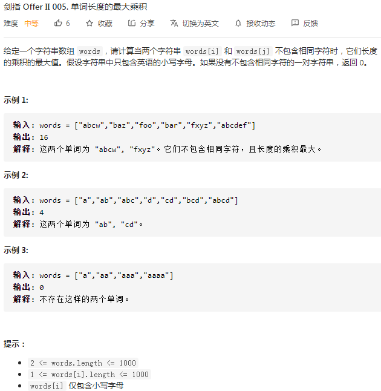
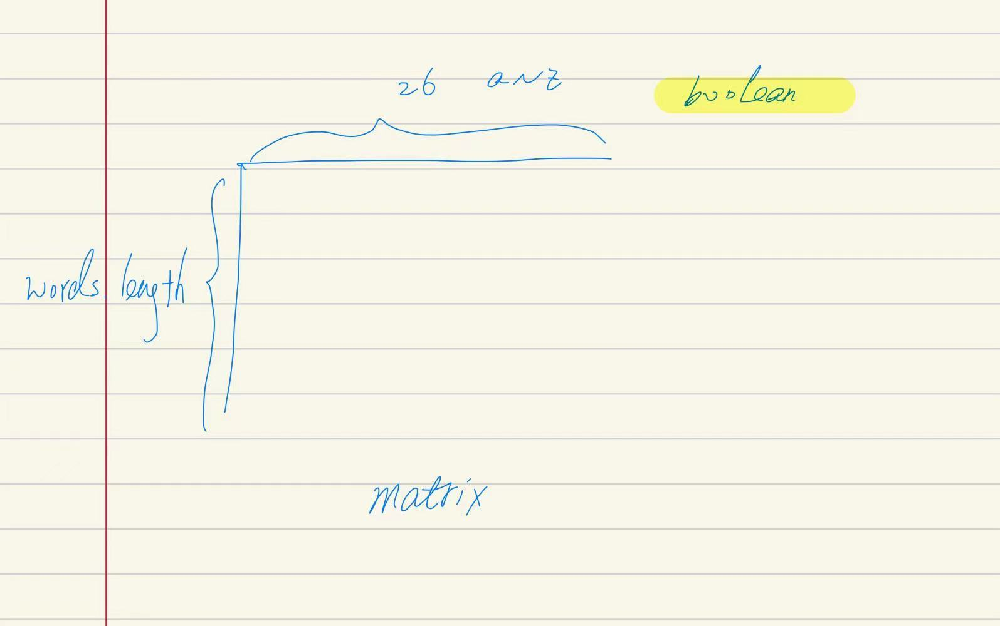

## 剑指II-005. 单词长度的最大乘积

### 题目

**src**：https://leetcode-cn.com/problems/aseY1I/

**题目**：



**题头**：

```java
public int maxProduct(String[] words) {
```


## Solution 1(matrix)

题目给了一个包含若干单词的数组，要求两个不重复的单词的长度**乘积最大**，返回该乘积。

关键是找出字母不重复的单词。

利用单词只能由26个小写英文字母组成，用二维数组（图示）打表记录，每一entry是一个单词，之后读表判断是否有相同字母，并求积。


<div align="center">  </div>


**Code**：

```java
public int maxProduct(String[] words) {
    boolean[][] matrix = new boolean[words.length][26];
        for(int i = 0; i < words.length; i++){
            for(char c : words[i].toCharArray()){
                matrix[i][c - 'a'] = true;
            }
        }
        int result = 0;
        for(int i = 0; i < words.length; i++){
            for(int j = i + 1; j < words.length; j++){
                int k = 0;
                for(; k < 26; k++){
                    if(matrix[i][k] && matrix[j][k]) break;
                }
                if(k == 26){
                    int prod = words[i].length() * words[j].length();
                    result = Math.max(result, prod);
                }
            }
        }
        return result;
}
```

**解法分析：**

| 易错点                                                       |
| ------------------------------------------------------------ |
| 把字符串转变为一个新的char数组，toCharArray()；              |
| for循环可以缺少初始化语句、循环条件和每次循环更新语句，例如： `for(; k < 26; k++){`； |

主要分为两部分，1.打表，2.读表判断；

time complexity: O(mn)，假设 m 为每个单词的平均长度，n 为 words 包含的单词数量；

space complexity: O(n)；

只要有了具象思维，写起来快，没有难抠的点。


## Solution 2(bitwise)

Solution 1是把单词数组中的每个单词变成一个entry，单个单词中的字母出现与否也占用一个维度，空间上可以再进行压缩。

如果将26个英文单词和32位的 int 联系起来，让单个单词中的字母占用一个 bit 位，0/1表示出现与否，就可以降维成一维 int 数组。

**Code**：

```java
public int maxProduct(String[] words) {
    int[] mask = new int[words.length];
        for(int i = 0; i < words.length; i++){
            for(char ch : words[i].toCharArray()){
                mask[i] |= 1 << (ch - 'a');
            }
        }
        int result = 0;
        for(int i = 0; i < words.length; i++){
            for(int j = i + 1; j < words.length; j++){
                if((mask[i] & mask[j]) == 0){
                    int prod = words[i].length() * words[j].length();
                    result = Math.max(prod, result);
                }
            }
        }
        return result;
}
```

**解法分析：**

| 易错点                                                       |
| ------------------------------------------------------------ |
| 把字符串转变为一个新的char数组，toCharArray()；              |
| binary 中放 1 用`|`，因为 OR 任意为1是1，举例 `mask[i] |= 1 << 2`，如果 mask[i] 原本是 001，就变为 101； |
| 运算符优先级，`==` 优先于 `&`，所以 `(mask[i] & mask[j]) == 0` 的括号是必要的； |

主要分为两部分，1.打表，2.读表判断；

本方法与方法1思路差不多，就是需要熟悉位运算的一些操作。

time complexity: O(mn)，假设 m 为每个单词的平均长度，n 为 words 包含的单词数量；

space complexity: O(n)；

