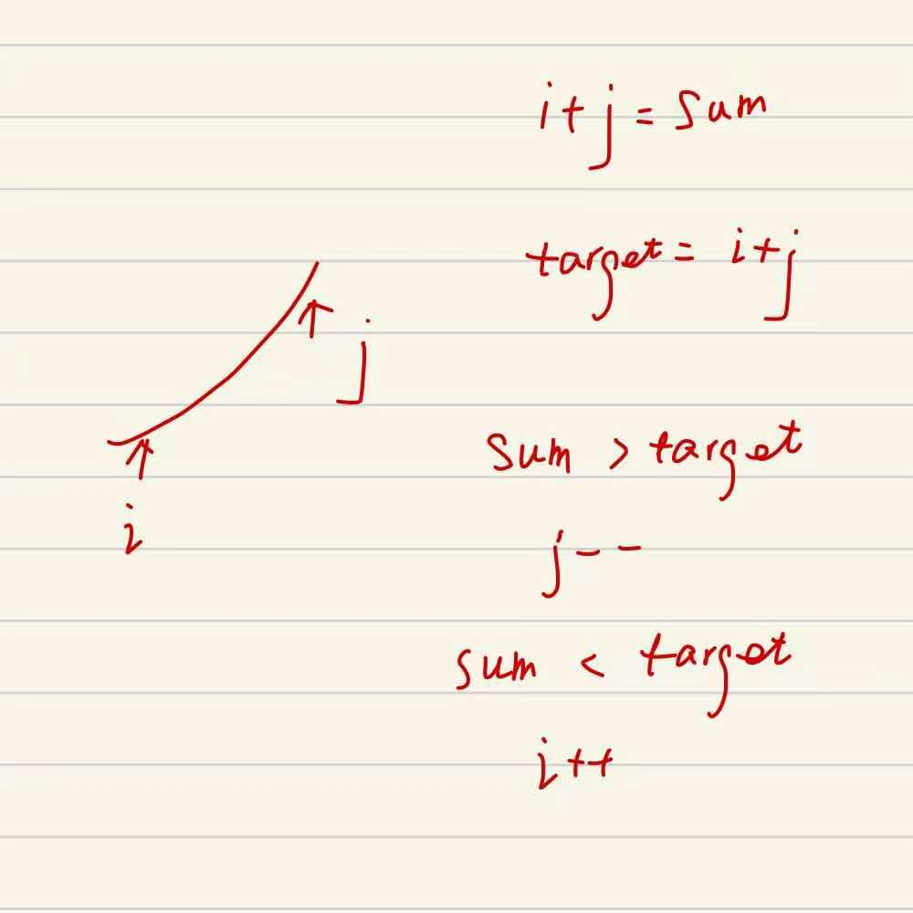

## 剑指II-006. 排序数组中两个数字之和

### 题目

**src**：https://leetcode-cn.com/problems/kLl5u1/

**题目**：


**题头**：

```java
public int[] twoSum(int[] nums, int target) {
```


## Solution 1(brute force)

题目给了一个包含若干数字的数组，要求找到两个数字的**和等于target**，返回这两个数字的下标。

数组升序且答案唯一。

思路是双指针分别从头尾走，利用数组的升序来调整指针位置，直到找到这两个数字。

<div align="center">  </div>

**Code**：

```java
public int[] twoSum(int[] nums, int target) {
    int left = 0;
    int right = nums.length - 1;
    while(left < right){
        int sum = nums[left] + nums[right];
        if(sum == target) return new int[]{left, right};
        else if(sum > target) right--;
        else left++;
    }
    return null;
}
```

**解法分析：**

| 易错点                                                       |
| ------------------------------------------------------------ |
| 直接向数组中加入元素，数组的静态初始化，举例：`new int[]{left, right}`； |
| sum 与 target 的关系 `>`、 `<`、 `==` 连在一起成为一个整体，所以用 if.. else if.. else... 连起来，不要用三个 if； |

time complexity: O(n)，遍历一遍 nums；

space complexity: O(1)；

