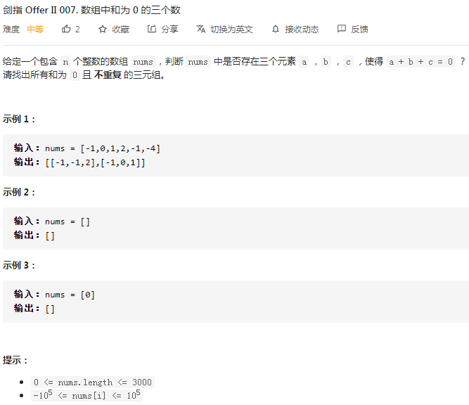
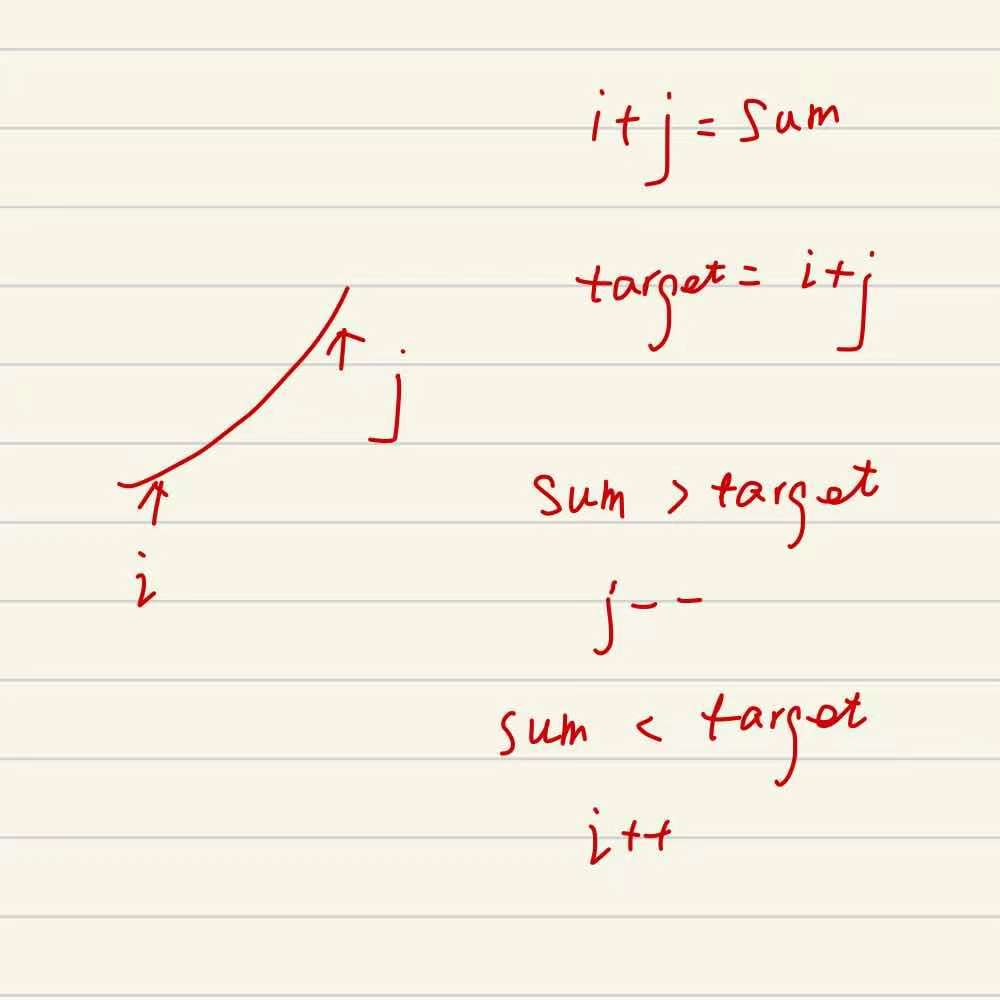

## 剑指II-007. 数组中和为 0 的三个数

### 题目

**src**：https://leetcode-cn.com/problems/1fGaJU/

**题目**：



**题头**：

```java
public List<List<Integer>> threeSum(int[] nums) {
```


## Solution 1(two pointer)

题目给了一个包含若干整数的数组，要求找到三个元素的**和等于0**，返回所有三元组。

* 返回的三元组不重复。

**把找三个元素转化为找两个元素，那就不难了。**

1.如果这个数组是有序（升序）的数组，固定一个值，就找剩下的两个元素，和 2sum 的原理差不多（2sum 见图示）；

2.因为可能不止一个答案，所以在找到一个吻合的之后，指针不能停住了，要继续移动；

3.注意去重，可以用和上一个指针的 val 比较，如果一致，就跳过；

* 三个元素中，固定下来的值移动时要去重；
* 在找到一个吻合的之后，指针继续移动时也要去重；



**Code**：

```java
public List<List<Integer>> threeSum(int[] nums) {
        ArrayList<List<Integer>> res = new ArrayList<>();
        Arrays.sort(nums);
        for(int i = 0; i < nums.length - 1; i++){
            if(i > 0 && nums[i] == nums[i-1]) continue; // remove duplicates;
            int l = i + 1;
            int r = nums.length - 1;
            while(l < r){
                int sum = nums[l] + nums[r] + nums[i];
                if(sum == 0){
                    res.add(Arrays.asList(nums[i], nums[l], nums[r]));
                    while(l < r && nums[l] == nums[l + 1]) l++; // remove duplicates;
                    l++;
                }else if(sum > 0){
                    r--;
                }else{
                    l++;
                }
            }
        }
        return res;
}
```

**解法分析：**

| 易错点                                                       |
| ------------------------------------------------------------ |
| 将指定数组升序排序，Arrays.sort()；                          |
| 把若干元素变为 List 形式，Arrays.asList(T... a)，举例`res.add(Arrays.asList(nums[i], nums[l], nums[r]));` |
| sum 与 target 的关系 `>`、 `<`、 `==` 连在一起成为一个整体，所以用 if.. else if.. else... 连起来，不要用三个 if； |

靠近数组下标边界的时候要小心，容易编译报错。

time complexity: O(n^2^)；

space complexity: O(1)；

