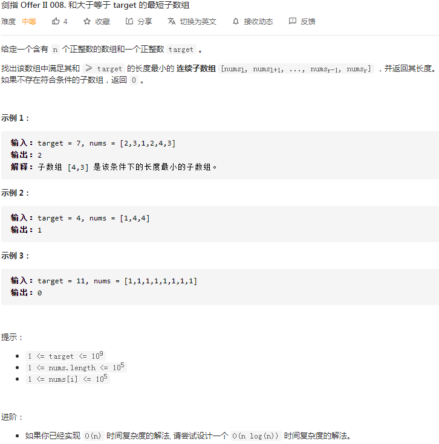
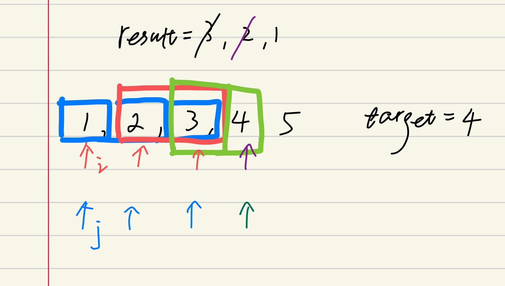

## 剑指II-008. 和大于等于 target 的最短子数组

### 题目

**src**：https://leetcode-cn.com/problems/2VG8Kg/

**题目**：



**题头**：

```java
public int minSubArrayLen(int target, int[] nums) {
```


## Solution 1(sliding window)

题目给了 nums 和 target，要我们找到 nums 中满足**和>=target**的**连续子数组**，要求返回**最短**的长度。

这道是经典的 sliding window 题目。两个指针 i，j 初始在同一起点，j 先走，直到满足题目的条件，也就是**和>=target**，此时轮到 i 前进了，开始找最短连续子数组，直到不满足条件。i，j 就这样前进，j 在前面领路，i 在后收尾。（例子如下图）

<div align="center">  </div>


**Code**：

```java
public int minSubArrayLen(int target, int[] nums) {
        int n = nums.length - 1;
        int left = 0;
        int right = 0;
        int sum = 0;
        int ans = nums.length + 1;
        while(right <= n){
            sum += nums[right];
            right++;
            while(left <= right && sum >= target){
                ans = Math.min(ans, right - left);
                sum -= nums[left];
                left++;
            }
        }
        return ans == nums.length + 1 ? 0 : ans;
}
```

**解法分析：**

| 易错点 |           |
| ------ | --------- |
| 求长度 | r - l + 1 |

time complexity: O(n)；

space complexity: O(1)；

