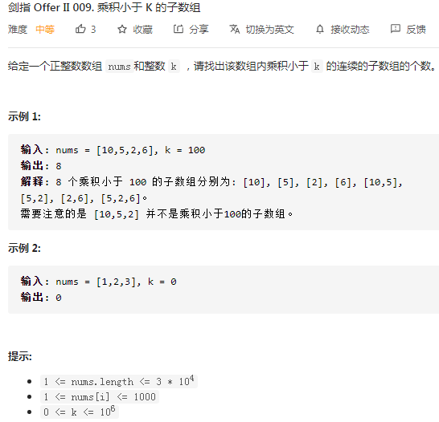
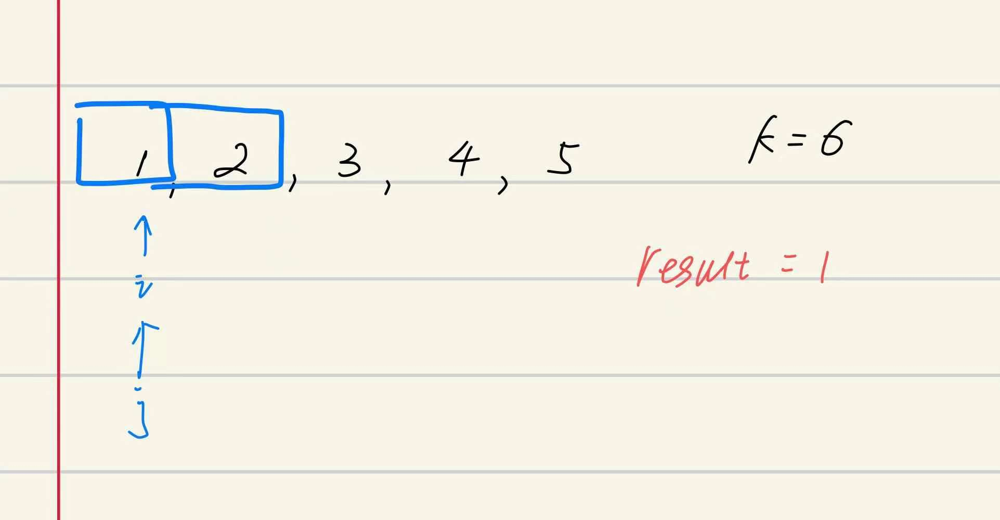
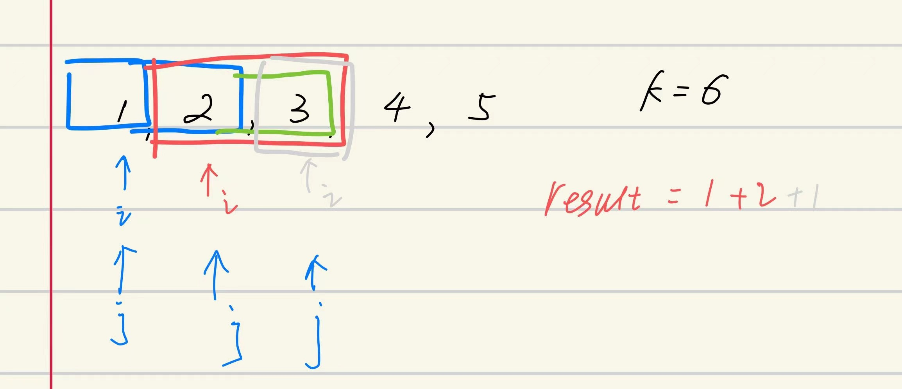

## 剑指II-009. 乘积小于 K 的子数组

### 题目

**src**：https://leetcode-cn.com/problems/ZVAVXX/

**题目**：



**题头**：

```java
public int numSubarrayProductLessThanK(int[] nums, int k) {
```


## Solution 1(sliding window)

题目给了nums和k，要我们找到nums中满足乘积**小于**k的**连续子数组**，要求返回子数组的**个数**；

* 如果是求**小于k**中最长的连续子数组，并返回长度，就很适合 sliding window；

但是本题要返回子数组的个数，所以我们建立 `i`，`j` 和个数`result`的关系（图示），发现了每次 j 前进， result 都可以增加  j - i + 1；

关于 product 的数据类型，根据题意 k < 10^6^，nums[i] <= 10^3^，所以 product <= 10^9^ 也必然小于 Integer.MAX_VALUE；





**Code**：

```java
public int numSubarrayProductLessThanK(int[] nums, int k) {
        int n = nums.length - 1;
        int product = 1;
        int l = 0;
        int ans = 0;
        for(int r = 0; r <= n; r++){
            product *= nums[r];
            while(r >= l && product >= k) product /= nums[l++];
            if(r >= l) ans += r - l + 1;
        }
        return ans;
}
```

**解法分析：**

| 易错点                                                       |
| ------------------------------------------------------------ |
| 如果连续子数组`[i,...,j]`的 product < k，那么`[i,...,j]`内部的所有连续子数组都符合条件，因为nums是正整数数组； |

time complexity: O(n)；

space complexity: O(1)；

