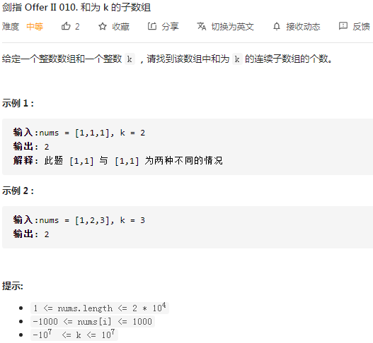
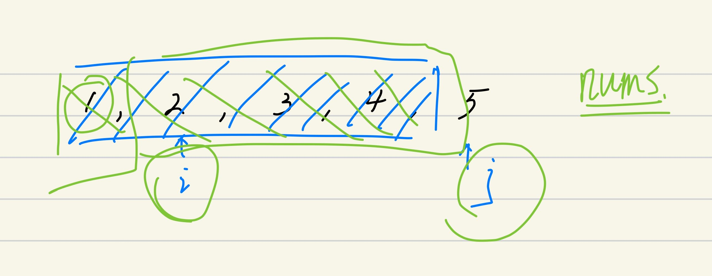
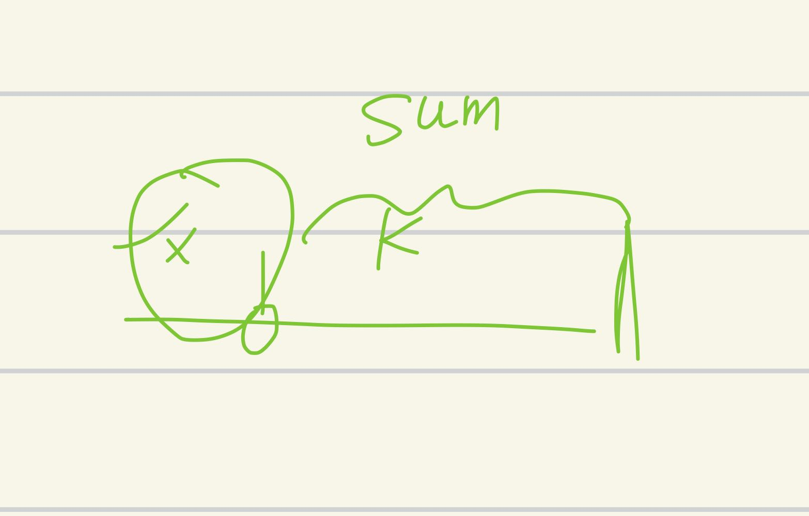

## 剑指II-010. 和为 k 的子数组

### 题目

**src**：https://leetcode-cn.com/problems/QTMn0o/

**题目**：



**题头**：

```java
public int subarraySum(int[] nums, int k) {
```


## Solution 1(prefix sum)

1.题目给了nums和k，要我们找到nums中满足和为k的**连续子数组**，要求返回子数组的**个数**；

* 因为本题nums是一个整数数组，可能有负数，那么sliding window的时候，j前进有可能会使sum变小，就无法定向调节sum了，所以sliding window 不可以；

2.题目中有**求和**和**连续子数组**，考虑用 prefix sum 切入，preSum 数组存储 prefix sum，比如 preSum[i] 储存 nums[i] 之前的所有元素的和；

* preSum[i] 可以包括 nums[i] 也可以不包括，区别在于 preSum 式子的写法，下面的例子就是**不包括** nums[i]；

* 这种要在 preSum 最后追加一个，记录nums[i] 的 index 从 0 到 nums.length - 1 元素的和；

* 还要注意到 preSum 数组比 nums 数组占用的长度大1，因为有追加的一个；
  $$
  preSum[i] = preSum[i-1] + nums[i-1]
  $$

3.关于 **sum 的数据类型**，根据题意 nums[i] <= 10^3^，nums.length <= 2 * 10^4^，所以 sum <= 2 * 10^7^ 也必然小于 Integer.MAX_VALUE；

4.之后读 preSum 数组的时候要注意有偏移，index 从 1 开始，也就是 preSum[1] = nums[0]，preSum[len] = nums[0] + ... + nums[len - 1]，向右偏移了1，所以如果要完整地从头开始，就是`preSum[j] - preSum[i - 1] `，而不是 `preSum[j] - preSum[i] `（图示）；

<div align="center">  </div>

**Code**：

```java
public int subarraySum(int[] nums, int k) {
        int len = nums.length;
        int[] preSum = new int[len + 1];
        for(int i = 1; i < len; i++) preSum[i] = preSum[i - 1] + nums[i - 1];
        for(int n : nums) preSum[len] += n; 
        int result = 0;
        for(int i = 1; i <= len; i++){
            for(int j = i; j <= len; j++){
                if(preSum[j] - preSum[i - 1] == k) result++;
            }
        }
        return result;
}
```

**解法分析：**

| 易错点                             |
| ---------------------------------- |
| preSum 数组比 nums 数组的长度大1； |
| preSum 会有偏移；                  |

time complexity: O(n^2^)；

space complexity: O(n)；

如果把preSum存到dic里面，那么通过一次遍历，就可以得到符合的子数组。


## Solution 2(prefix sum, hashtable)

建立一个dic，key 和 value 如下表：

| key    | value |
| ------ | ----- |
| preSum | times |

在每次查到吻合的`preSum`时，`result`加1。

* result 用来储存待返回的结果；

那么，怎么样的 preSum 是符合要求的，有以下两点：

| 要求                                 | 解释                                  |
| ------------------------------------ | ------------------------------------- |
| preSum == k                          | 题目说的`和为k`                       |
| preSum == k + x（x 曾经存到dic里面） | 意思是这一段包含`和为k`的部分（下图） |




**Code**：

```java
public int subarraySum(int[] nums, int k) {
        int len = nums.length;
        int sum = 0;
        int result = 0;
        HashMap<Integer, Integer> map = new HashMap<>();
        // map.put(0, 1);
        for(int n : nums){
            sum += n;
            if(sum == k) result++; // why?
            if(map.containsKey(sum - k)){
                result += map.get(sum - k);
            }
            map.put(sum, map.getOrDefault(sum, 0) + 1);
        }
        return result;
}
```

**解法分析：**

| 易错点                                                       |                                           |
| ------------------------------------------------------------ | ----------------------------------------- |
| 熟练 查询是否存在某key，得到该键对应的value，更新键值对，getOrDefault()； | map.containsKey(), map.get(), map.put()； |

针对 code 中的 why 进行解释，这是为哈希表还是空表的时候，比如`nums[0]`就满足 k，可以不漏值而写；也可以通过在前面放一个哈希表的起始值`map.put(0, 1)`，相当于 preSum = 0，times = 1，这样就可以在这个初始值的基础上计算 preSum；

*  漏值情况举例：`nums = [3, ...], k = 3` 和 `nums = [1, 1, 1,...], k = 3`；


time complexity: O(n)；

space complexity: O(n)；

