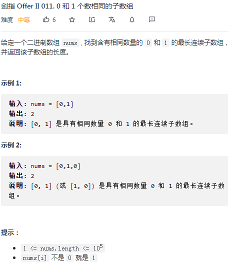
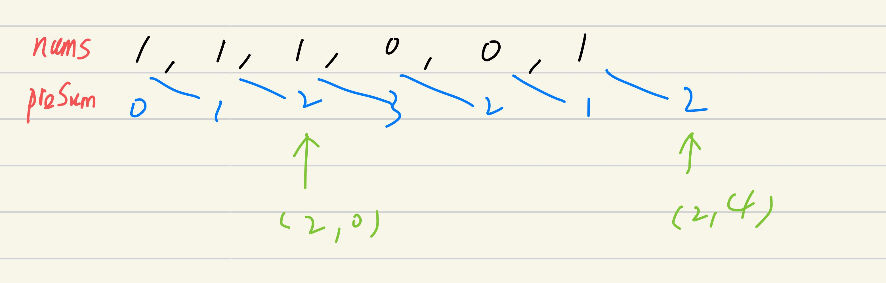

## 剑指II-011. 0 和 1 个数相同的子数组

### 题目

**src**：https://leetcode-cn.com/problems/A1NYOS/

#### description

<div align="center">  </div>

#### method signature

```java
public int findMaxLength(int[] nums) {
```

### solutions

#### solution 1 (prefix sum + hashtable)

**题目要 0, 1 数量相等的最长连续子数组，返回该子数组的长度。**

* nums 中只有 0 或 1，考虑用替换来把**数量相等**转化为**求和**。如果把 0 换成 -1，如此，某一段的元素和为 0，就意味着这段的 0, 1 数量相等。

> 实现的时候要注意：
>
> 1. prefix sum 的偏移；
> 2. sub array 的长度读取；

**prefix sum 会有偏移**，preSum[1] 包含 nums[0]，preSum[0] 不含 nums 中的任意元素，也就是说 preSum 的 index 与 nums 的 index 有偏移。

hashtable 的 **key** 为当前 preSum 的值，继续遍历 preSum，如果读到相同的 key，就意味着这段的 0, 1 数量相等。那么，这段 **sub array 的长度**可以通过在首次 default 的时候，存入当时 preSum 的 index，之后读到对应 key 时，hashtable 的 value 相减来得到（下图）。

<div align="center">  </div>

> bonus：
>
> 根据题意，nums.length >= 1，nums 又只有 0,1，那么 sub array 长度必然 **>= 2**，所以我们让循环从 2 开始，来节约一点时间。


*Code*

```java
public int findMaxLength(int[] nums) {
        int len = nums.length;
        int[] preSum = new int[len + 1];
        for(int i = 1; i <= len; i++) preSum[i] = preSum[i - 1] + (nums[i - 1] == 0 ? -1 : 1);
        HashMap<Integer, Integer> map = new HashMap<>();
        int result = 0;
        for(int i = 2; i <= len; i++){
            if(!map.containsKey(preSum[i - 2])) map.put(preSum[i - 2], i - 2);
            if(map.containsKey(preSum[i])) result = Math.max(result, i - map.get(preSum[i]));
        }
        return result;
    }
```

**Pros and Cons**

| big O            | -                     |
| ---------------- | --------------------- |
| time complexity  | O(n)，n = nums.length |
| space complexity | O(n)                  |

*cons*

hashtable 和 preSum 数组都占用了额外空间。

*pros*

思路直观。


#### solution 2 (prefix sum, hashtable -> regular)

**使用数组模拟 hashtable，来节约空间。**

> hashtable 起到的作用是：1. 检查某一 preSum[i] **（hashtable 的 key）**是否出现过；2.记录这一 preSum[i] 所对应的首次下标；

只要 hash 数组留出 `nums.length` 的长度，就可以用来记录首次出现下标。

hash 的 `nums.length + 1` 长度留给 preSum，最坏情况 nums 全是 1，那么 hash 的 `nums.length + 1` 部分将被填满。


*Code*

```java
class Solution {
    public int findMaxLength(int[] nums) {
        int len = nums.length;
        int[] preSum = new int[len + 1];
        for(int i = 1; i <= len; i++) preSum[i] = preSum[i - 1] + (nums[i - 1] == 0 ? -1 : 1);
        int[] hash = new int[2 * len + 1];
        Arrays.fill(hash, -1);
        int result = 0;
        for(int i = 2; i <= len; i++){
            if(hash[preSum[i - 2] + len] == -1) hash[preSum[i - 2] + len] = i - 2;
            if(hash[preSum[i] + len] != -1) result = Math.max(result, i - hash[preSum[i] + len]);
        }
        return result;
    }
}
```

**Pros and Cons**

| big O            | -                     |
| ---------------- | --------------------- |
| time complexity  | O(n)，n = nums.length |
| space complexity | O(n)                  |

*cons*

hash 和 preSum 数组都占用了额外空间。

*pros*

思路巧妙。


#### solution 3 (hashtable)

**本质上和 solution 1，solution 2 一样，都是通过对 nums 元素的替换，把求 01 数量相等转化为求和**。

> hashtable 的第一例需要提前初始化，`(0, -1)` 意为 preSum 等于 0，首次出现的下标为 -1，也就是什么元素都没有。
>

这里的 preSum 是包含当前元素的。


> bonus：
>
> 这里不可以用 `getOrDefault(key, default value)`。
>
> 1. 初次：写入下标；
> 2. 不是初次：读到对应的 value，来计算 sub array 的长度；
>
> 可见，如果不是初次，那么读值之后还有一系列操作，来得到 sub array 的长度，所以需要分开讨论。

```java
// map.getOrDefault(key, default value)

if(map.containsKey(sum)) map.get(sum);
else map.put(sum, i);
```


*Code*

```java
class Solution {
    public int findMaxLength(int[] nums) {
        int n = nums.length;
        Map<Integer, Integer> map = new HashMap<>();
        map.put(0, -1);

        // initialize max length: result.
        // initialize current element sum: sum.
        int result = 0;
        int sum = 0; 

        for(int i = 0; i < n; i++){
            sum += nums[i] == 1? 1 : -1;
            if(map.containsKey(sum)){
                int temp = i - map.get(sum);
                result = Math.max(result, temp);
            }else{
                map.put(sum, i);
            }
        }
        return result;
    }
}
```

**Pros and Cons**

| big O            | -                     |
| ---------------- | --------------------- |
| time complexity  | O(n)，n = nums.length |
| space complexity | O(n)                  |

*cons*

hashtable 占用了额外空间。

*pros*

思路直观。

