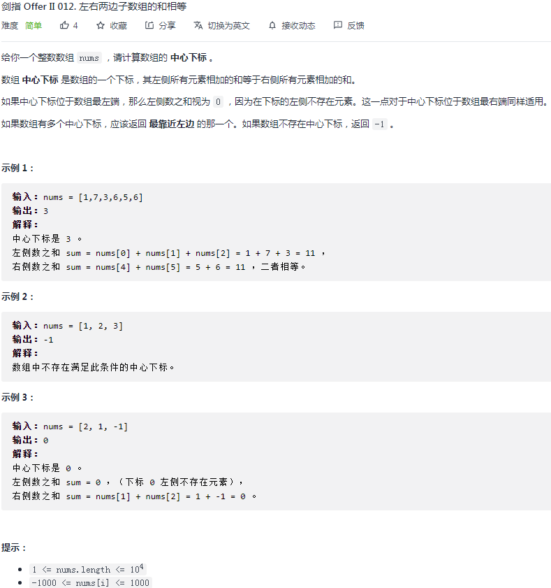
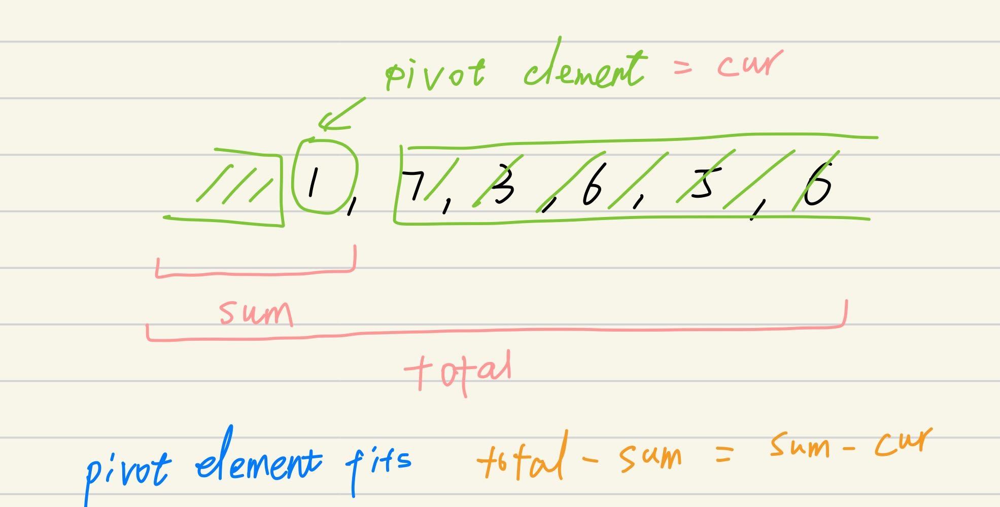

## 剑指II-012. 左右两边子数组的和相等

### 题目

**src**：https://leetcode-cn.com/problems/tvdfij/

#### description

<div align="center">  </div>

#### method signature

```java
public int pivotIndex(int[] nums) {
```

### solutions

#### solution 1 ()

**题目要求满足左侧元素和等于右侧元素和的 pivot index ，可以发现如下规律（下图） 。**

<div align="center">  </div>


*Code*

```java
class Solution {
    public int pivotIndex(int[] nums) {
        int total = 0;
        int sum = 0;
        for(int n : nums) total += n;
        for(int i = 0; i < nums.length; i++){
            sum += nums[i];
            if(total - sum == sum - nums[i]) return i;
        }
        return -1;
    }
}
```

**Pros and Cons**

| big O            | -                     |
| ---------------- | --------------------- |
| time complexity  | O(n)，n = nums.length |
| space complexity | O(1)                  |

*pros*

找到规律后，思路直观。


