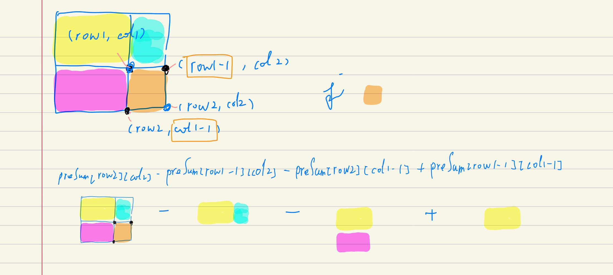

## 剑指II-013. 二维子矩阵的和

### 题目

**src**：https://leetcode-cn.com/problems/O4NDxx/

#### description

<div align="center">  </div>

#### method signature

```java
class NumMatrix {
    public NumMatrix(int[][] matrix) {}
    public int sumRegion(int row1, int col1, int row2, int col2) {}
}

/**
 * Your NumMatrix object will be instantiated and called as such:
 * NumMatrix obj = new NumMatrix(matrix);
 * int param_1 = obj.sumRegion(row1,col1,row2,col2);
 */
```

### solutions

#### solution 1 (matrix prefix sum)

**题目要我们先初始化 matrix，之后写一个方法来实现计算区域面积内的元素和。**

> 实现的时候要注意：
>
> 1. prefix sum 的偏移；
> 2. 如何求区域内的元素和；

**prefix sum 会有偏移**，以普通的一维数组为例，preSum[1] 包含 nums[0]，preSum[0] 不含 nums 中的任意元素，也就是说 preSum 的 index 与 nums 的 index 有偏移。

**求区域内的元素和**，可以先从基本的某一点的 prefix sum 开始理解，示意图如下：

<div align="center">  </div>

之后推广到给区域的左上角和右下角，求该区域元素和，示意图如下：

<div align="center">  </div>


> 计算区域元素和 bonus:
>
> **prefix sum 与 matrix 间存在偏移**，求某一区域的元素和的式子（上图式子）可以看到偏移 1，又因为本题 matrix 的 index 从 0 开始，如果不做调整，就会编译报错，因此，我们要对传入的左上角和右下角坐标统一 `+1`，来方便后续的计算；


*Code*

```java
class NumMatrix {
    int[][] preSum;
    public NumMatrix(int[][] matrix) {
        int m = matrix.length;
        int n = matrix[0].length;
        preSum = new int[m + 1][n + 1];
        // i - row of matrix, j - column of matrix;
        for(int i = 1; i <= m; i++){
            for(int j = 1; j <= n; j++){
                preSum[i][j] = preSum[i - 1][j] + preSum[i][j - 1] - preSum[i - 1][j - 1] + matrix[i - 1][j - 1];
            }
        }
    }
    
    public int sumRegion(int row1, int col1, int row2, int col2) {
        row1++; col1++; row2++; col2++;
        return preSum[row2][col2] - preSum[row1 - 1][col2] - preSum[row2][col1 - 1] + preSum[row1 - 1][col1 - 1];

    }
}
```

**Pros and Cons**

| big O            | -        |
| ---------------- | -------- |
| time complexity  | O(n * m) |
| space complexity | O(n * m) |
