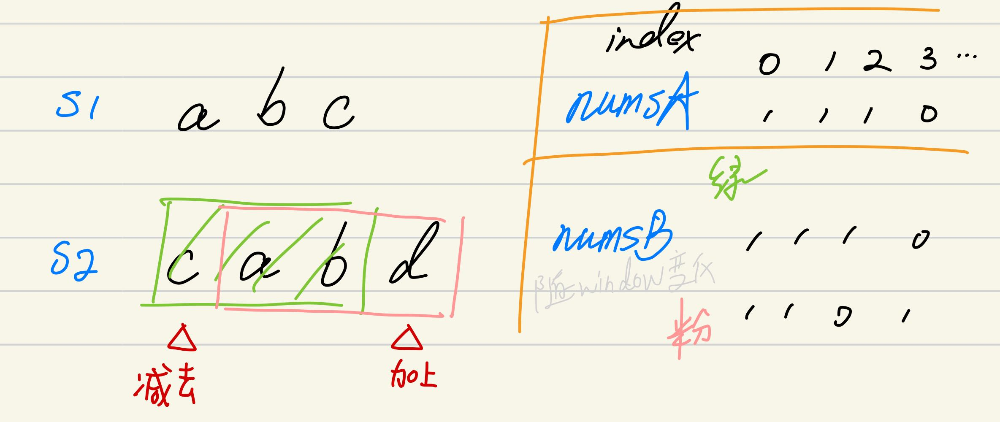

## 剑指II-014. 字符串中的变位词

### 题目

**src**：https://leetcode-cn.com/problems/MPnaiL/

#### description

<div align="center">  </div>

#### method signature

```java
public boolean checkInclusion(String s1, String s2) {
```

### solutions

#### solution 1 (sliding window)

**题目要我们判断 s1 的某一种排列是否是 s2 的子串。**

因为本题是子串，子串由连续不间断的一串元素组成，就想到用 sliding window 来做。

> 实现的时候要注意：
>
> 1. s1 的某一种排列；
> 2. 在 s2 中寻找 s1 的某一种排列；

**s1 的某一种排列，不必真的写出 s1 的全排列，解释如下：**

先提问：假设我们有 4 个士兵可派遣，其中有 2 个斧兵，2 个长枪兵，有多少种布阵方法？

我们对具体的布阵不关心，无论存在几种方法，都要符合 2 个斧兵，2 个长枪兵。推到本题，s1 的所有元素就可以理解为小兵，有不同兵种，我们按兵种记下来，就可以应对各种情况。

* 数组的**下标**是兵种（a-z，可以通过通通减去 a，变为 int），**下标对应的值**是每个兵种的数量（int）。

**在 s2 中寻找 s1 的某一种排列：**

这就是对照尺（s1），我们凭这个一把一把地在地图上（s2）比较，直到找到对应的。

在 sliding window 时需要进行维护，示意图如下：

<div align="center">  </div>


> bonus:
>
> 比较两数组是否相等 ：`Arrays.equals(int[] a, int[] a2)`，两数组相等则返回 true；
>
> 因为题目没有说 s1 长度一定 <= s2 长度，所以这方面的边界情况可以拎出来讨论一下；


*Code*

```java
class Solution {
    public boolean checkInclusion(String s1, String s2) {
        // cornor case
        if(s1.length() > s2.length()) return false;

        int[] numsA = new int[26];
        int[] numsB = new int[26];
        for(int i = 0; i < s1.length(); i++){
            numsA[s1.charAt(i) - 'a']++;
            numsB[s2.charAt(i) - 'a']++;
        }
        for(int i = s1.length(); i < s2.length(); i++){
            if(Arrays.equals(numsA, numsB)) return true;
            numsB[s2.charAt(i - s1.length()) - 'a']--;
            numsB[s2.charAt(i) - 'a']++;
        }
        return Arrays.equals(numsA, numsB);
    }
}
```

**Pros and Cons**

| big O            | -    |
| ---------------- | ---- |
| time complexity  | O(n) |
| space complexity | O(1) |

