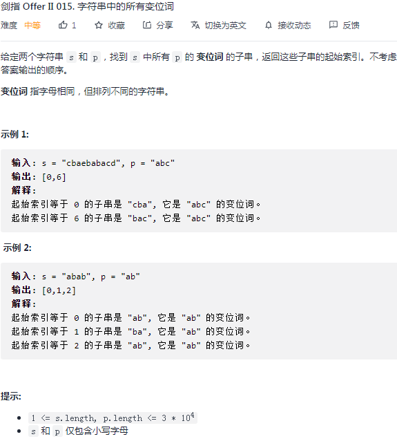

## 剑指II-015. 字符串中的所有变位词

### 题目

**src**：https://leetcode-cn.com/problems/VabMRr/

#### description

<div align="center">  </div>

#### method signature

```java
public List<Integer> findAnagrams(String s, String p) {
```

### solutions

#### solution 1 (sliding window)

**题目要我们找到 p 的某一种排列在 s 中的位置。**

套用 剑指II_014 的思路（下图），不过这次要记录符合要求的 window 的起点。


<div align="center">  </div>


> bonus:
>
> 本题要求子串的起始下标，所以第一个或者最后一个需要在循环外面讨论：
>
> * 可以在第一把位放好之后就讨论；
> * 也可以在跑到最后一把的时候，出循环来讨论；


*Code*

```java
class Solution {
    public List<Integer> findAnagrams(String s, String p) {
        List<Integer> res = new ArrayList<>();
        
        // cornor case
        if(p.length() > s.length()) return res;

        int[] numsA = new int[26];
        int[] numsB = new int[26];
        for(int i = 0; i < p.length(); i++){
            numsA[p.charAt(i) - 'a']++;
            numsB[s.charAt(i) - 'a']++;
        }
        if(Arrays.equals(numsA, numsB)) res.add(0);

        for(int i = p.length(); i < s.length(); i++){
            numsB[s.charAt(i - p.length()) - 'a']--;
            numsB[s.charAt(i) - 'a']++;
            if(Arrays.equals(numsA, numsB)) res.add(i - p.length() + 1);
        }
        return res;
    }
}
```

**Pros and Cons**

| big O            | -    |
| ---------------- | ---- |
| time complexity  | O(n) |
| space complexity | O(1) |

