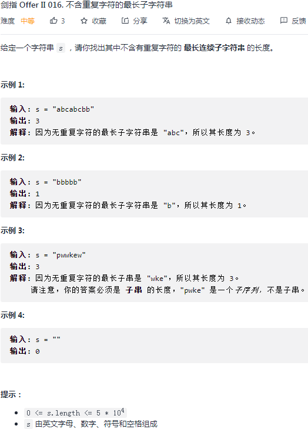
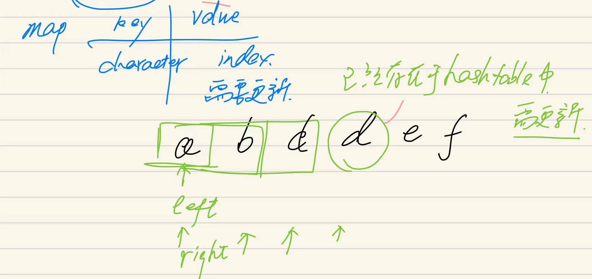
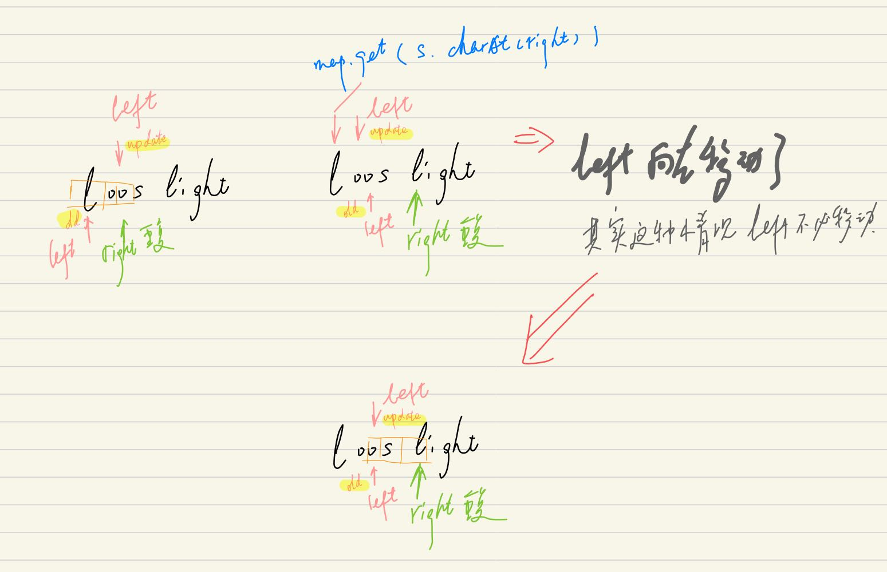

## 剑指II-016. 不含重复字符的最长子字符串

### 题目

**src**：https://leetcode-cn.com/problems/wtcaE1/

#### description

<div align="center">  </div>

#### method signature

```java
public int lengthOfLongestSubstring(String s) {
```

### solutions

#### solution 1 (sliding window + hashtable)

题目给出 s，求**不含重复字符**的**最长**连续子字符串的**长度**。

> 实现时要注意：
>
> 1. 如何去重；

**去重：**使用 hashtable 来**完整**记录每种字符最新的出现下标，key 为字符，value 为最新出现的下标。

sliding window 的思路见下图：

<div align="center">  </div>


> bonus:
>
> 在 sliding window 时，right 读到已有的值，那么这时就需要把 left 放到新的位置，这时两种情况：
>
> 1. left 有必要移动：重复是当前 window 里的；
> 2. left 没必要移动：重复是 window 左边的，这时移动的话，窗口就不单向了；

<div align="center">  </div>


*Code*

```java
class Solution {
    public int lengthOfLongestSubstring(String s) {
        // cornor case
        if(s.length() == 0 || s == null) return 0;

        HashMap<Character, Integer> map = new HashMap<>();
        int left = 0;
        int ans = 0;
        for(int right = 0; right < s.length(); right++){
            if(map.containsKey(s.charAt(right))) left = Math.max(left, map.get(s.charAt(right)) + 1);
            map.put(s.charAt(right), right);
            ans = Math.max(right - left + 1, ans);
        }
        return ans;
    }
}
```

**Pros and Cons**

| big O            | -    |
| ---------------- | ---- |
| time complexity  | O(n) |
| space complexity | O(n) |

