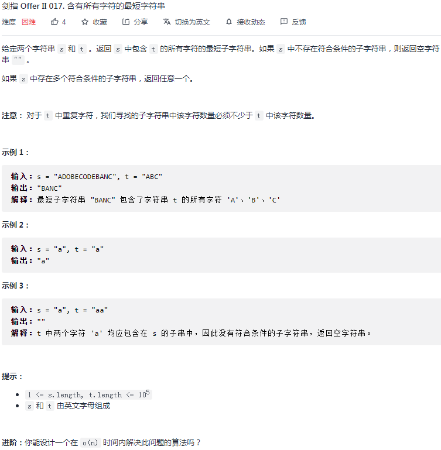

## 剑指II-017. 含有所有字符的最短字符串

### 题目

**src**：https://leetcode-cn.com/problems/M1oyTv/

#### description

<div align="center">  </div>

#### method signature

```java
public String minWindow(String s, String t) {
```

### solutions

#### solution 1 (sliding window + hashtable)

s 中包含 **t 的所有字符**的**最短**子字符串，**返回子字符串**。

*s，t 均由英文字母组成。*

基本思路是：记下 t 的所有字符，以此为根据，在 s 上进行 sliding window 操作。

> 实现时要注意：
>
> 1. 记下 t 的所有字符；
> 2. 具体如何 sliding window，也就是 left 何时走，right 何时走；
> 3. 符合条件的 window 如何选最短；

使用 hashtable 来记录**记录字符**，每个种类的出现次数。

具体**如何 sliding window**，示意图如下。

如果一个 window 中刚好把 t 中的所有字符都找到了，那么，这就是**符合条件的 window**。

* 我们通过在 s 中每找到一个吻合的字符，计数器 count 就 +1，之后看计数器是不是等于 t 的长度。
* 但是如果不是在 s 的最后找全，因为计数器一旦到这个数就不变了，之后的都会被认为是符合的，举例 s 为 `abb`，t 为 `a`，那么因为找得到 a，count 变为 1，之后的 b 因为在 t 中找不到，所以计数器不变，就还是 1，这时即使子串长度变长了，还是可以通过计数器的判断。所以，我们不能仅仅通过这点来得到结果，**应该在每一次通过计数器判断后，记录当前长度，在此基础上选更短的。**


<div align="center">  </div>


> bonus:
>
> 不可以在循环开始`char curR = s.charAt(r)`，之后就用 `curR`, `curL`代替 `s.charAt(r)`, `s.charAt(r)`，因为循环内只是保持 right 的不动，left 是可能会移动的，如果一开始就把 `curL` 固定下来了，那么就可能失真。


*Code*

```java
class Solution {
    public String minWindow(String s, String t) {
        // cornor case
        if(t.length() > s.length()) return "";

        HashMap<Character, Integer> mapT = new HashMap<>();
        HashMap<Character, Integer> mapS = new HashMap<>();
        for(int i = 0; i < t.length(); i++){
            char cur = t.charAt(i);
            mapT.put(cur, mapT.getOrDefault(cur, 0) + 1);
        }
        int count = 0;
        int len = Integer.MAX_VALUE;
        String ans = "";
        for(int l = 0, r = 0; r < s.length(); r++){
            // char curR = s.charAt(r);
            // char curL = s.charAt(l);
            mapS.put(s.charAt(r), mapS.getOrDefault(s.charAt(r), 0) + 1);
            if(mapT.containsKey(s.charAt(r)) && mapS.get(s.charAt(r)) <= mapT.get(s.charAt(r))) count++;
            while(l < r && (!mapT.containsKey(s.charAt(l)) || mapS.get(s.charAt(l)) > mapT.get(s.charAt(l)))){
                int cnt = mapS.get(s.charAt(l)) - 1;
                mapS.put(s.charAt(l), cnt);
                l++;
            }
            if(count == t.length() && r - l + 1 < len){
                len = r - l + 1;
                ans = s.substring(l, r + 1);
            }
        }
        return ans;
    }
}
```

**Pros and Cons**

| big O            | -    |
| ---------------- | ---- |
| time complexity  | O(n) |
| space complexity | O(n) |

