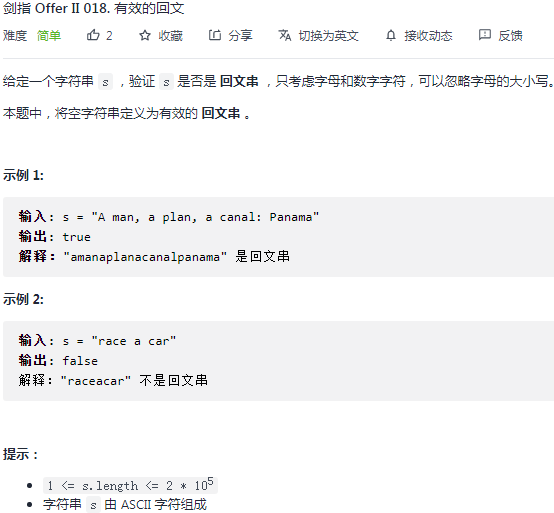

## 剑指II 018. 有效的回文

### 题目

**src**：https://leetcode-cn.com/problems/XltzEq/

#### description

<div align="center">  </div>

#### method signature

```java
public boolean isPalindrome(String s) {
```

### solutions

#### solution 1 (two pointers)

**判断 s 是不是有效的回文串。**

使用对撞双指针，i 从左出发，j 从右出发，一一比对，直到它俩相遇即可。

* 有对不上的就证明不是回文。

> 题中让我们只考虑字母和数字，并且忽略字母的大小写，也就是说：
>
> 1. 遇到不是字母或数字的字符，我们就跳过 - `Character.isLetterOrDigit(char ch)`；
> 2. 比对时，需要转化为大写或都转化为小写 - `Character.toLowerCase(char ch)`；


> bonus：
>
> 碰面的讨论： `<=` or `<`
>
> 1. `<=`：i, j 相遇的时候先不跳出；
> 2. `<`：不允许 i, j 相遇；
>
> 但是中间的一个元素对是不是回文不影响，所以都可以。

*Code*

```java
class Solution {
    public boolean isPalindrome(String s) {
        int i = 0;
        int j = s.length() - 1;
        while(i <= j){
            if(!Character.isLetterOrDigit(s.charAt(i))) i++;
            else if(!Character.isLetterOrDigit(s.charAt(j))) j--;
            else{
                char charA = Character.toLowerCase(s.charAt(i++));
                char charB = Character.toLowerCase(s.charAt(j--));
                if(charA != charB) return false;
            }
        }
        return true;
    }
}
```

**Pros and Cons**

| big O            | -    |
| ---------------- | ---- |
| time complexity  | O(n) |
| space complexity | O(1) |

