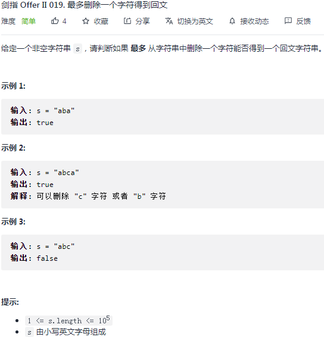

## 剑指 II 019. 最多删除一个字符得到回文

### 题目

**src**：https://leetcode-cn.com/problems/RQku0D/

#### description

<div align="center">  </div>

#### method signature

```java
public boolean validPalindrome(String s) {
```

### solutions

#### solution 1 (two pointers)

**判断删掉一个字符后， s 是不是有效的回文串。**

*s 由小写英文字母组成。*

> 实现要注意：
>
> 1. 删掉一个字符；

**删掉一个字符**，也就是给一次对不上的机会。理论上来说，对不上时，可能是左侧的字符需要走，也可能是右侧的字符需要走。

那么针对这种情况，我们再写个方法，专门用来判断已经用掉机会（没机会了）的这段是回文与否。

* 传入这段的左右边界来定位它。


*Code*

```java
class Solution {
    public boolean validPalindrome(String s) {
        for(int i = 0, j = s.length() - 1; i < j; i++, j--){
            if(s.charAt(i) != s.charAt(j)) return isPalindrome(s, i + 1, j) || isPalindrome(s, i, j - 1);
        }
        return true;
    }
    private boolean isPalindrome(String s, int i, int j){
        while(i < j){
            if(s.charAt(i++) != s.charAt(j--)) return false;
        }
        return true;
    }
}
```

**Pros and Cons**

| big O            | -    |
| ---------------- | ---- |
| time complexity  | O(n) |
| space complexity | O(1) |

