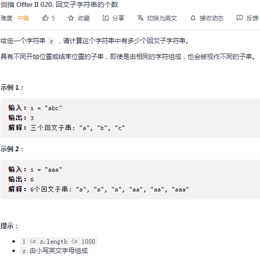
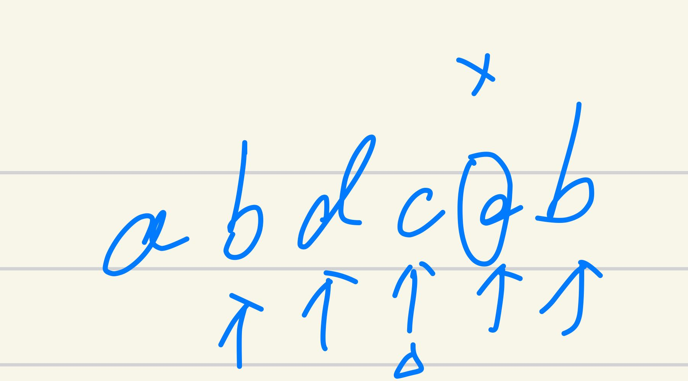

## 剑指 II 020. 回文子字符串的个数

### 题目

**src**：https://leetcode-cn.com/problems/a7VOhD/

#### description

<div align="center">  </div>

#### method signature

```java
public int countSubstrings(String s) {
```

### solutions

#### solution 1 (中心扩展法)

**s 中有多少个回文子字符串。**

枚举每一个可能的中心，i, j 分别向两边扩展，i 指到的字符与 j 指到的字符相等时，继续走，否则停下（下图）。

<div align="center" >  </div>

> **实现要注意：**
>
> 我们找到的回文字符串理论上有两种，一种有中心元素（中轴点，`aba`），一种没有中心元素（直接可对折，`aa`），这两种的扩展方式是有区别的；

**有无中心元素**的分开讨论：

* 有中心元素的回文子串，我们就从它的轴点扩展，起点 `left = i, right = i`；
* 没有中心元素的回文子串，如何我们还是从“中心元素”开始扩展，那么不可能有收获，所以我们站在河两岸，起点 `left = i, right = i + 1`；


*Code*

```java
class Solution {
    public int countSubstrings(String s) {
        int n = s.length();
        int result = 0;
        for(int i = 0; i < n; i++){
            int left = i;
            int right = i;
            while(left >= 0 && right < n){
                if(s.charAt(left) == s.charAt(right)){
                    left--;
                    right++;
                    result++;
                }
                else break;
            }
        }
        for(int i = 0; i < n - 1; i++){
            int left = i;
            int right = i + 1;
            while(left >= 0 && right < n){
                if(s.charAt(left) == s.charAt(right)){
                    left--;
                    right++;
                    result++;
                }
                else break;
            }
        }
        return result;
    }
}
```

**Pros and Cons**

| big O            | -       |
| ---------------- | ------- |
| time complexity  | O(n^2^) |
| space complexity | O(1)    |

