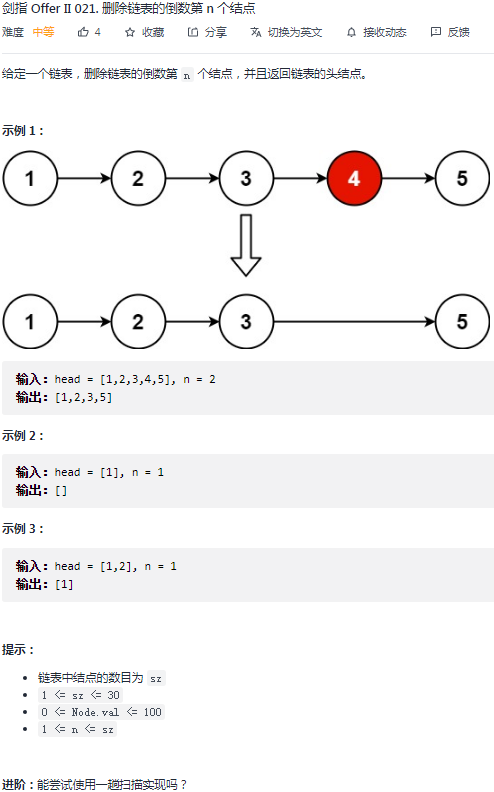
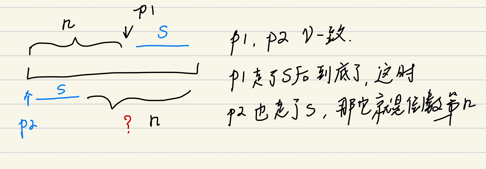
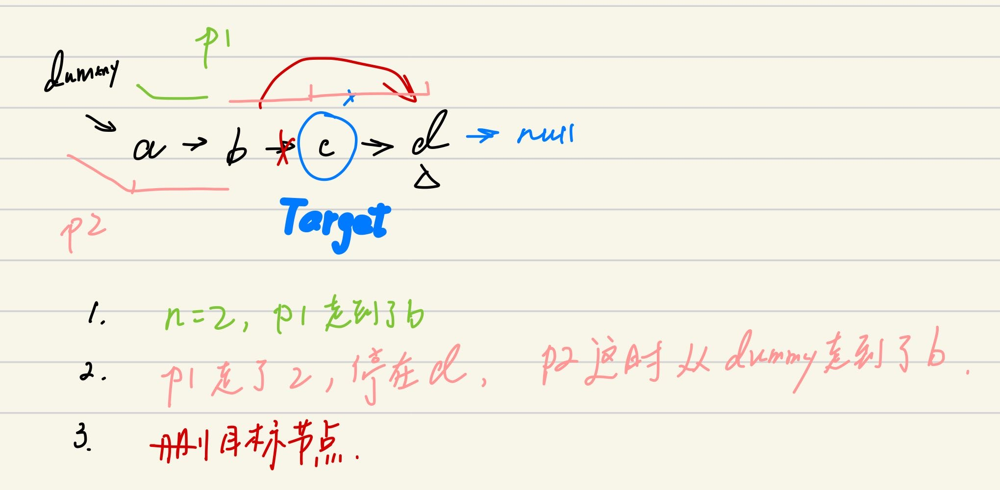

## 剑指 II 021. 删除链表的倒数第 n 个结点

### 题目

**src**：https://leetcode-cn.com/problems/SLwz0R/

#### description

<div align="center">  </div>

#### method signature

```java
public ListNode removeNthFromEnd(ListNode head, int n) {
```

### solutions

#### solution 1 (two pointers)

**题目让我们删除链表的倒数第 n 个节点。**

题中不是双向链表，所以不能通过从最后一个节点往回走来定位目标节点，但我们可以通过：

1. 以 O(n) 的时间复杂度代价，走一遍给定的链表来得到链表长度，从而定位目标节点；
   * 题目说只用一趟扫描实现，那就换个思路。
2. 前后双指针，因为链表是定长的，那么让 p1 先走 n 步，之后 p1, p2 一起走，p1 撞墙时，p2 就是倒数第 n（下图示意）。

<div align="center" >  </div>

> **具体细节见下图的例子**

<div align="center" >  </div>


*Code*

```java
/**
 * Definition for singly-linked list.
 * public class ListNode {
 *     int val;
 *     ListNode next;
 *     ListNode() {}
 *     ListNode(int val) { this.val = val; }
 *     ListNode(int val, ListNode next) { this.val = val; this.next = next; }
 * }
 */

class Solution {
    public ListNode removeNthFromEnd(ListNode head, int n) {
        ListNode dummy = new ListNode(0);
        dummy.next = head;
        
        // p1: fast
        // p2: slow
        ListNode fast = dummy;
        ListNode slow = dummy;
        while(n > 0 && fast.next != null){
            fast = fast.next;
            n--;
        }
        while(fast.next != null){
            fast = fast.next;
            slow = slow.next;
        }
        slow.next = slow.next.next;
        return dummy.next;
    }
}
```

**Pros and Cons**

| big O            | -    |
| ---------------- | ---- |
| time complexity  | O(n) |
| space complexity | O(1) |

