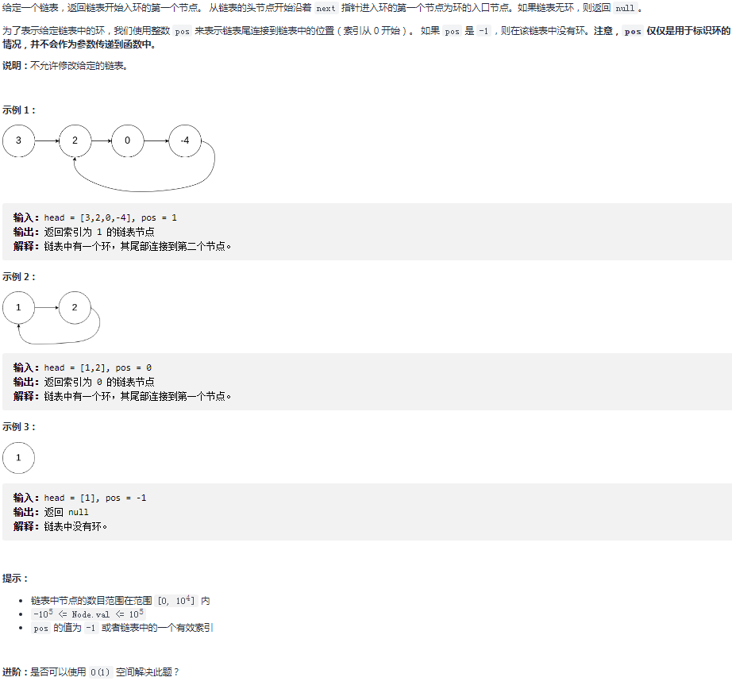
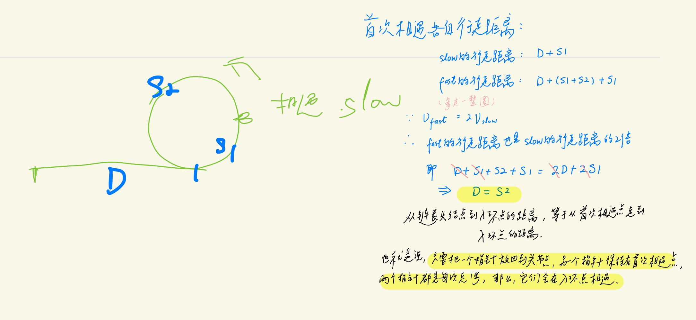

## 剑指 II 022. 链表中环的入口节点

### 题目

**src**：https://leetcode-cn.com/problems/c32eOV/

#### description

<div align="center">  </div>

#### method signature

```java
public ListNode detectCycle(ListNode head) {
```

### solutions

#### solution 1 (快慢双指针)

**求入环节点。**

> 快慢双指针来解，具体思路见下图：
>

<div align="center" >  </div>


> **bonus：**
>
> 因为 fast 每次要走 2 步，所以要确保 `fast.next != null`，也就是保证链表至少有 2 个节点。
>
> 因为与运算 `&&` 是短路运算，所以把 `fast != null` 放前面。


*Code*

```java
/**
 * Definition for singly-linked list.
 * class ListNode {
 *     int val;
 *     ListNode next;
 *     ListNode(int x) {
 *         val = x;
 *         next = null;
 *     }
 * }
 */

public class Solution {
    public ListNode detectCycle(ListNode head) {
        if(head == null) return null;
        ListNode slow = head;
        ListNode fast = head;
        while(fast != null && fast.next != null){
            slow = slow.next;
            fast = fast.next.next;
            if(slow == fast){
                ListNode nodeL = head;
                while(nodeL != slow){
                    nodeL = nodeL.next;
                    slow = slow.next;
                }
                return nodeL;
            }
        }
        return null;
    }
}
```

*Code* 

思路一样，不过这个是把 `fast` 放回头结点。

```java
public class Solution {
    public ListNode detectCycle(ListNode head) {
        ListNode fast = head, slow = head;
        while (true) {
            if (fast == null || fast.next == null) return null;
            fast = fast.next.next;
            slow = slow.next;
            if (fast == slow) break;
        }
        fast = head;
        while (slow != fast) {
            slow = slow.next;
            fast = fast.next;
        }
        return fast;
    }
}

作者：jyd
链接：https://leetcode-cn.com/problems/c32eOV/solution/jian-zhi-offer-ii-022-lian-biao-zhong-hu-8f1m/
来源：力扣（LeetCode）
著作权归作者所有。
```


**Pros and Cons**

| big O            | -                       |
| ---------------- | ----------------------- |
| time complexity  | O(n)，slow 合计走了一圈 |
| space complexity | O(1)                    |

