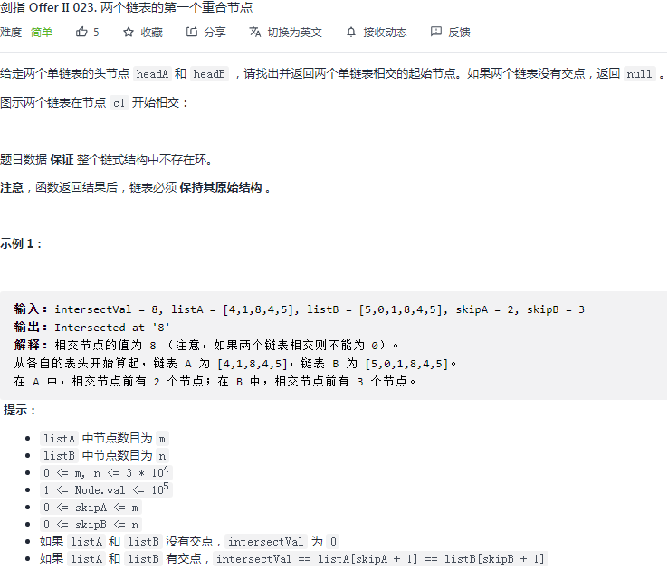

## 剑指 II 023. 两个链表的第一个重合节点

### 题目

**src**：https://leetcode-cn.com/problems/3u1WK4/

#### description

<div align="center">  </div>

#### method signature

```java
public ListNode getIntersectionNode(ListNode headA, ListNode headB) {
```

### solutions

#### solution 1 (two pointers)

**求两相交链表的第一个交点。**

简单说就是，tail to head。

> 双指针来解，具体思路见下图：
>

<div align="center" >  </div>


*Code*

```java
/**
 * Definition for singly-linked list.
 * public class ListNode {
 *     int val;
 *     ListNode next;
 *     ListNode(int x) {
 *         val = x;
 *         next = null;
 *     }
 * }
 */

public class Solution {
    public ListNode getIntersectionNode(ListNode headA, ListNode headB) {

        // cornor case
        if(headA == null || headB == null) return null;

        ListNode pA = headA;
        ListNode pB = headB;

        while(pA != pB){
            pA = pA == null ? headB : pA.next;
            pB = pB == null ? headA : pB.next;
        }
       return pA;
    }
}
```

**Pros and Cons**

| big O            | -    |
| ---------------- | ---- |
| time complexity  | O(n) |
| space complexity | O(1) |

