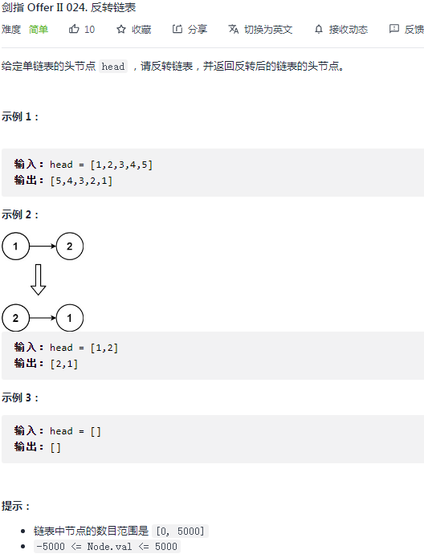
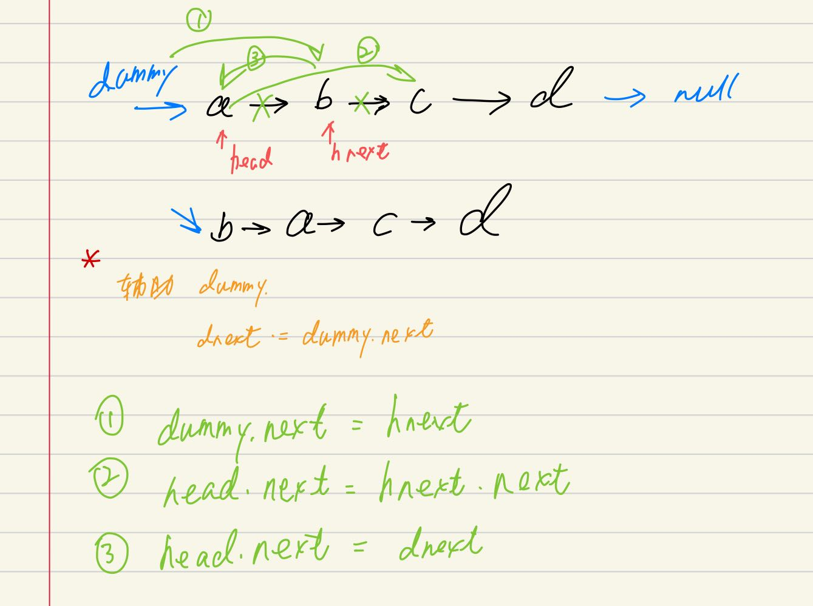
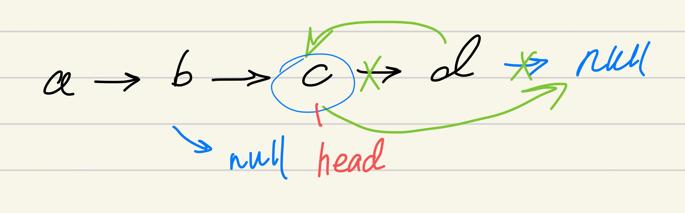

## 剑指 II 024. 反转链表

### 题目

**src**：https://leetcode-cn.com/problems/UHnkqh/

#### description

<div align="center">  </div>

#### method signature

```java
public ListNode reverseList(ListNode head) {
```

### solutions

#### solution 1 (iteration)

**反转链表。**

> 每个节点反转的具体思路见下图：
>

<div align="center" >  </div>


> **几个辅助的变量：**
>
> `dummy`
>
> `dnext`，因为 `head` 一直在前进，所以需要一个变量固定在头结点的位置。
>
> `hnext`


*Code*

```java
/**
 * Definition for singly-linked list.
 * public class ListNode {
 *     int val;
 *     ListNode next;
 *     ListNode() {}
 *     ListNode(int val) { this.val = val; }
 *     ListNode(int val, ListNode next) { this.val = val; this.next = next; }
 * }
 */

class Solution {
    public ListNode reverseList(ListNode head) {
        ListNode dummy = new ListNode(0);
        dummy.next = head;
        while(head != null && head.next != null){
            ListNode hnext = head.next;
            ListNode dnext = dummy.next;
            dummy.next = hnext;
            head.next = hnext.next;
            hnext.next = dnext;
        }
        return dummy.next;
    }
}
```

**Pros and Cons**

| big O            | -    |
| ---------------- | ---- |
| time complexity  | O(n) |
| space complexity | O(1) |


#### solution 2 (recursion)

**反转链表。**

> 递归的**终止条件**：走到最后一个节点了；
>
> 递归的**拆解**：就是往前走；
>
> 递归的**入参，返回值**：链表节点；

走到底，会返回到递归栈的上一层，也就是上一个节点，进行翻转操作，具体见下图：

<div align="center" >  </div>


*Code*

```java
class Solution {
    public ListNode reverseList(ListNode head) {
        if(head == null || head.next == null) return head;
        ListNode list = reverseList(head.next);
        head.next.next = head;
        head.next = null;
        return list;
    }
}
```

**Pros and Cons**

| big O            | -    |
| ---------------- | ---- |
| time complexity  | O(n) |
| space complexity | O(n) |

