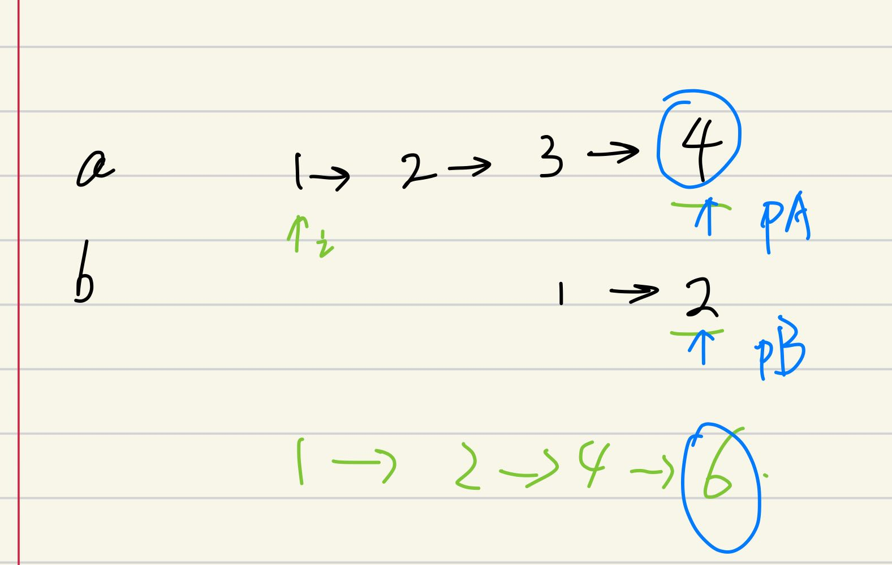
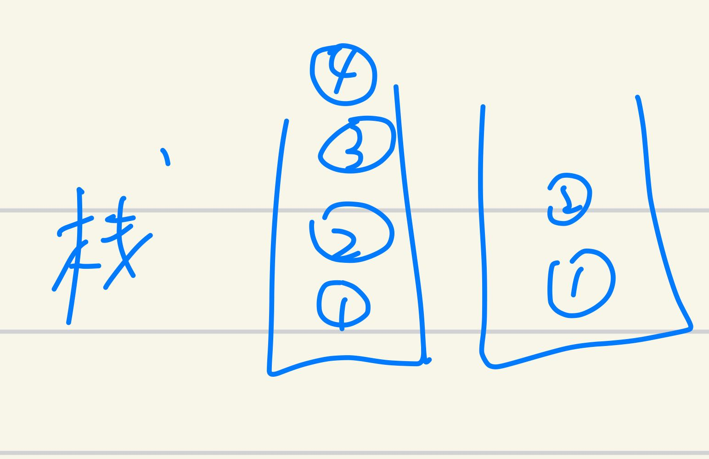
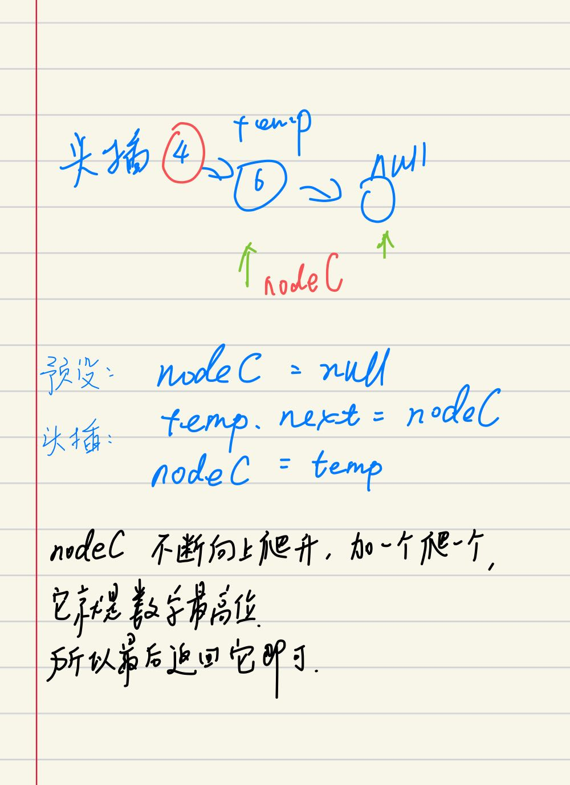

## 剑指 II 025. 链表中的两数相加

### 题目

**src**：https://leetcode-cn.com/problems/lMSNwu/

#### description

<div align="center">  </div>

#### method signature

```java
public ListNode addTwoNumbers(ListNode l1, ListNode l2) {
```

### solutions

#### solution 1 (stack，头插法)

**链表中的元素相加，高位在链表开始位置，加完返回一个新链表。**

主要难点：加法需要从最低位对齐，而链表的特性只能左侧对齐（下图）。我们可以通过两种方式来解：

1. 翻转链表，之后就可以从头开始加；
2. 利用栈先进后出的特性，让链表元素一一进栈，走完为止，之后同步出栈，做加法（下图）；

当然，加完之后的元素也要低位在链表尾部，也就是新算出来的数去指向上一个算出来的数，像栈一样往里挤。这种插入新节点的方法就是**头插法**（下图）。

> 链表加法：
>

<div align="center" >  </div>

> 辅助栈：

<div align="center" >  </div>

> 头插法：

<div align="center" >  </div>


> **bonus：**
>
> 计算过程中可能要进位。
>
> 我们维护一个进位变量 `carry`，计算中有两种情况：
>
> 1. 没算完：在计算下一位的时候加上 `carry`；
> 2. 算完了：若此时 `carry` 不等于 0，那么这个 `carry` 就要当最高位；


*Code*

```java
class Solution {
    public ListNode addTwoNumbers(ListNode l1, ListNode l2) {
        ListNode pA = l1;
        ListNode pB = l2;
        Stack<Integer> stackA = new Stack<>();
        Stack<Integer> stackB = new Stack<>();
        while(pA != null){
            stackA.push(pA.val);
            pA = pA.next;
        }
        while(pB != null){
            stackB.push(pB.val);
            pB = pB.next;
        }
        int carry = 0;
        ListNode nodeC = null;
        while(!stackA.isEmpty() || !stackB.isEmpty() || carry > 0){
            int sum = carry;
            sum += stackA.isEmpty() ? 0 : stackA.pop();
            sum += stackB.isEmpty() ? 0 : stackB.pop();
            ListNode temp = new ListNode(sum % 10);
            temp.next = nodeC;
            nodeC = temp;
            carry = sum / 10;
        }
        return nodeC;
    }
}
```

**Pros and Cons**

| big O            | -    |
| ---------------- | ---- |
| time complexity  | O(n) |
| space complexity | O(n) |


