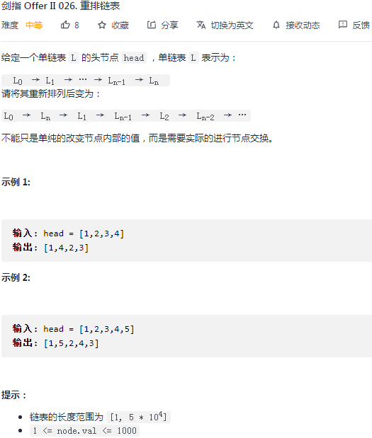
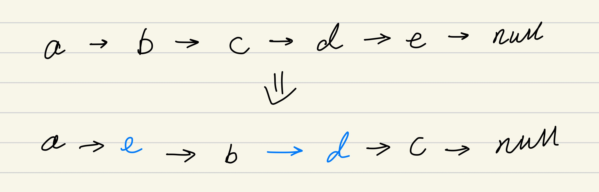
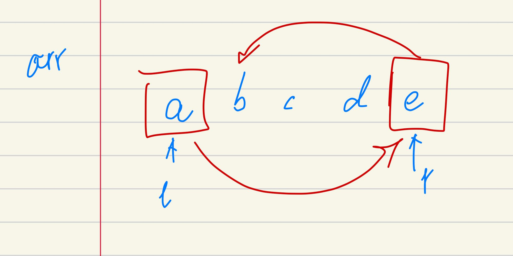
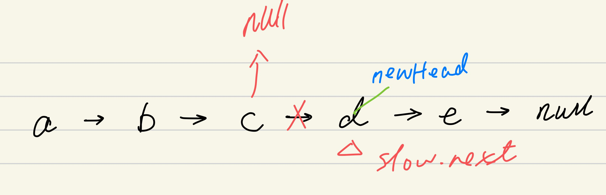
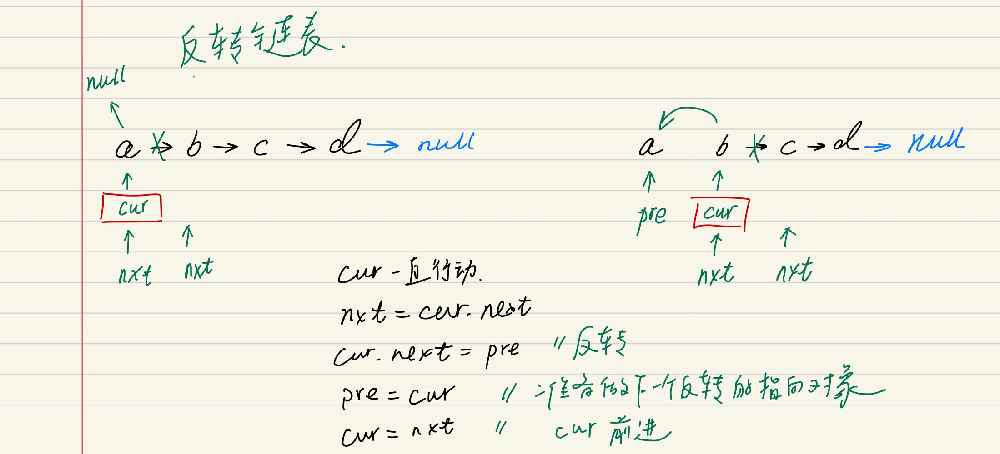
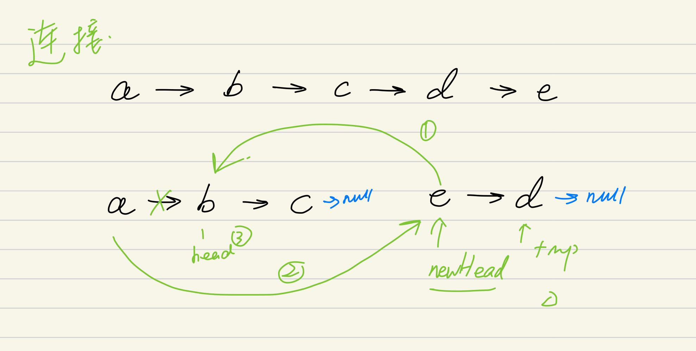

## 剑指 II 026. 重排链表

### 题目

**src**：https://leetcode-cn.com/problems/LGjMqU/

#### description

<div align="center">  </div>

#### method signature

```java
public void reorderList(ListNode head) {
```

### solutions

#### solution 1 (数组 + 对撞双指针)

**题目让我们交错地排列给定链表。**

可以看到，变化后的链表把最后一个元素移到了第二位，也就是让第一个元素指向它，它指向原本第二位的元素（下图 2）。

因为 `left`，`right` 指针在数组上对撞比较方便，所以我们把链表的元素一一放到数组当中，之后用 `left`，`right` 指针实现元素的移位。

> 链表的排序：
>

<div align="center" >  </div>

> 链表元素的移位：

<div align="center" >  </div>


> **bonus：**
>
> 排序完之后，将尾节点指向 `null`；


*Code*

```java
class Solution {
    public void reorderList(ListNode head) {
        // cornor case
        if(head == null || head.next == null) return;

        List<ListNode> arr = new ArrayList<>();
        ListNode p = head;
        while(p != null){
            arr.add(p);
            p = p.next;
        }
        int left = 0;
        int right = arr.size() - 1;
        while(left < right){
            arr.get(right).next = arr.get(left).next;
            arr.get(left).next = arr.get(right);
            right--;
            left++;
        }
        arr.get(left).next = null;
    }
}
```

**Pros and Cons**

| big O            | -    |
| ---------------- | ---- |
| time complexity  | O(n) |
| space complexity | O(n) |

*cons*

额外占用了数组的线性空间。

*pros*

思路清晰。


#### solution 2 (快慢双指针)

**题目让我们交错地排列给定链表。**

可以看到，变化后的链表（下图 1）是在原链表的基础上，一头一尾地这样连接起来。

> **这就给了一个新的思路：**
>
> 我们先把原链表平分成前后两段，变成 a, b 两个链表，之后将后半段 b 翻转，这时 b 的头结点就是原链表的尾节点，原本不太方便的一头一尾，就可以按顺序 a 一个，b 一个串起来。

简单说就是：1. 快慢指针分段，断开才算分了；2. 翻转后半段；3. 连接；（具体见图示）

<div align="center" >  </div>

> **1. 快慢指针分段，断开：**
>
> 先指定 slow 的下一个节点为后半段链表的头结点，之后通过 slow 指向 null，来断开前后两段。

<div align="center" >  </div>

> **2. 翻转后半段：**
>
> `cur`, `nxt` 起初在头结点，`pre` 起初在头结点的前一个节点，可以视作在 dummy。
>
> 简单说就是
>
>  *nxt 前进到 cur 的下一个节点（反转了就不能走了），*
>
>  *cur 指向前一个节点 pre（反转），*
>
> *之后 pre 前进到 cur，*
>
>  *cur 前进到 nxt。*
>
> 直到 `cur` 走出链表跳出。

<div align="center" >  </div>

> **3. 连接：**
>
> 假设前半段链表为 a，后半段链表为 b。
>
> 要实现 a1 -> b1 -> a2 -> b2，我们这么做
>
> *先指定一个 tmp，意义和 nxt 差不多，它用来指 b 段的路，*
>
>  *b 的头结点指向 a 头结点的下一个节点，这样就实现了 b1 -> a2，*
>
>  *a 的头结点指向 b 头结点，这样就实现了 a1 -> b1，*
>
> *之后，我们要让前后半段都进一步，*
>
>  *head 前进到 newHead.next，*
>
>  *newHead 前进到 tmp。*
>
> 直到 `newHead` 走出链表跳出。

<div align="center" >  </div>


*Code*

```java
class Solution {
    public void reorderList(ListNode head) {
        // cornor case
        if(head == null || head.next == null) return;
        
        ListNode fast = head;
        ListNode slow = head;
        while(fast != null && fast.next != null){
            slow = slow.next;
            fast = fast.next.next;
        }
        ListNode newHead = slow.next;
        slow.next = null;
        newHead = reverseList(newHead);
        while(newHead != null){
            ListNode temp = newHead.next;
            newHead.next = head.next;
            head.next = newHead;
            head = newHead.next;
            newHead = temp;
        }
    }
    private ListNode reverseList(ListNode head){
        ListNode prev = null;
        ListNode cur = head;
        ListNode nxt = head;
        while(cur != null){
            nxt = cur.next;
            cur.next = prev;
            prev = cur;
            cur = nxt;
        }
        return prev;
    }
}
```

**Pros and Cons**

| big O            | -    |
| ---------------- | ---- |
| time complexity  | O(n) |
| space complexity | O(1) |

*cons*

快慢双指针分段，反转链表，交叉连接两个链表，三个链表知识点合一，需要认知清楚。

*pros*

不需要额外的线性空间占用。
