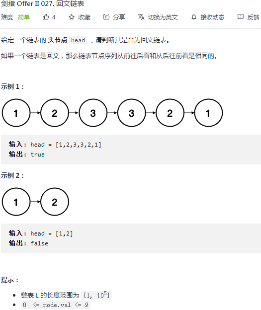
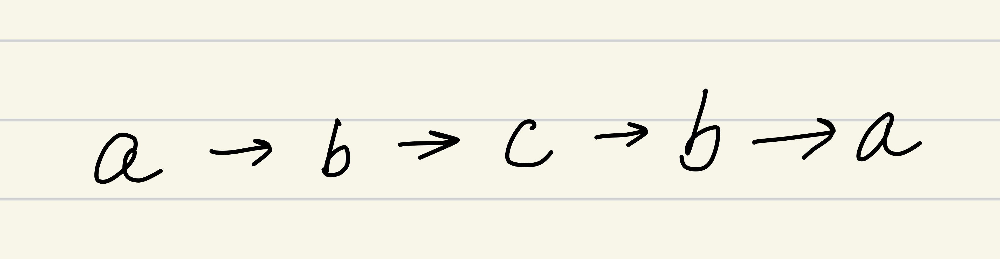

## 剑指 II 027. 回文链表

### 题目

**src**：https://leetcode-cn.com/problems/aMhZSa/

#### description

<div align="center">  </div>

#### method signature

```java
public boolean isPalindrome(ListNode head) {
```

### solutions

#### solution 1 (数组 + 对撞双指针)

**判断给定链表是否为回文链表。**

回文链表（下图）头尾元素相等，如果这些元素在数组当中，就简单很多。

我们使用 `left`，`right` 指针在数组上对撞，先把链表元素的值一一放到数组当中，之后用 `left`，`right` 对比。

<div align="center" >  </div>


*Code*

```java
class Solution {
    public boolean isPalindrome(ListNode head) {
        // cornor case
        if(head == null || head.next == null) return true;

        ArrayList<Integer> arr = new ArrayList<>();
        ListNode p = head;
        while(p != null){
            arr.add(p.val);
            p = p.next;
        }
        int left = 0;
        int right = arr.size() - 1;
        while(left < right){
            if(arr.get(left) != arr.get(right)) return false;
            left ++;
            right --;
        }
        return true;
    }
}
```

**Pros and Cons**

| big O            | -    |
| ---------------- | ---- |
| time complexity  | O(n) |
| space complexity | O(n) |

*cons*

额外占用了数组的线性空间。

*pros*

思路清晰。


#### solution 2 (快慢双指针)

**判断给定链表是否为回文链表。**

如果把回文链表从中间断开，之后翻转后半段，发现这时的前后半段是吻合的。

> **思路：**
>
> 我们先把原链表平分成前后两段，变成 a, b 两个链表，之后将后半段 b 翻转，这时 b 的头结点就是原链表的尾节点，原本不太方便比较的头尾，就可以按顺序进行比较。

简单说就是：1. 快慢指针分段，断开才算分了；2. 翻转后半段；3. 比较；（具体见图示）

<div align="center" >  </div>

> 注意：像 `a->b` 这样的链表，我们希望 `slow` 走到 `a` 点，之后断开 `a` 向 `b` 的指向；
>
> 这时有两种方法：
>
> 1. 创建一个 `dummy` 节点，让 `fast`，`slow` 从 `dummy` 开始走，而不是从 `head` 开始，这样 `fast` 走 2 格，从而 `slow` 走到 `a` 点；
> 2. 不创建新的节点，还是从 `head` 走，改变 `while` 循环的条件来适应这类情况：
>    * `fast != null and fast.next != null` ，因为 `fast` 开始在 `head`，而不是尾节点，所以可以移动，那么 `slow` 也可以前进 1 格，就不在 `a` 点了。
>    * `fast.next != null and fast.next.next != null`，`fast` 就动不了，因此 `slow` 还在原地。


> **1. 快慢指针分段，断开：**
>
> 先指定 slow 的下一个节点为后半段链表的头结点，之后通过 slow 指向 null，来断开前后两段。

<div align="center" >  </div>

> **2. 翻转后半段：**
>
> `cur`, `nxt` 起初在头结点，`pre` 起初在头结点的前一个节点，可以视作在 dummy。
>
> 简单说就是
>
>  *nxt 前进到 cur 的下一个节点（反转了就不能走了），*
>
>  *cur 指向前一个节点 pre（反转），*
>
> *之后 pre 前进到 cur，*
>
>  *cur 前进到 nxt。*
>
> 直到 `cur` 走出链表跳出。

<div align="center" >  </div>


*Code*

```java
class Solution {
    public boolean isPalindrome(ListNode head) {
        // cornor case
        if(head == null || head.next == null) return true;

        ListNode dummy = new ListNode(0);
        dummy.next = head;
        ListNode fast = dummy;
        ListNode slow = dummy;
        while(fast != null && fast.next != null){
            fast = fast.next.next;
            slow = slow.next;
        }
        ListNode newHead = slow.next;
        slow.next = null;
        newHead = reverseLinkedlist(newHead);
        ListNode left = head;
        ListNode right = newHead;
        while(left != null && right != null){
            if(left.val != right.val){
                return false;
            }
            left = left.next;
            right = right.next;
        }
        return true;
    }
    private ListNode reverseLinkedlist(ListNode head){
        ListNode prev = null;
        ListNode cur = head;
        ListNode nxt = head;
        while(cur != null){
            nxt = cur.next;
            cur.next = prev;
            prev = cur;
            cur = nxt;
        }
        return prev;
    }
}
```

**Pros and Cons**

| big O            | -    |
| ---------------- | ---- |
| time complexity  | O(n) |
| space complexity | O(1) |

*cons*

快慢双指针分段，反转链表，比较两个链表，三个链表知识点合一，需要认知清楚。

*pros*

不需要额外的线性空间占用。
