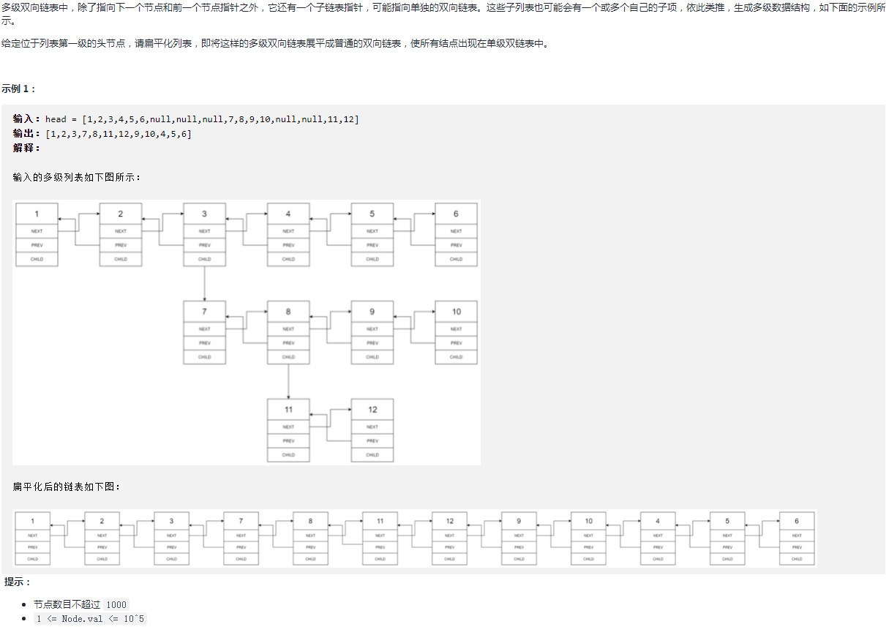
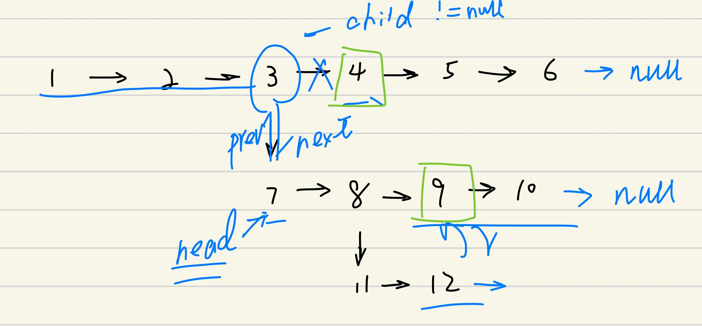
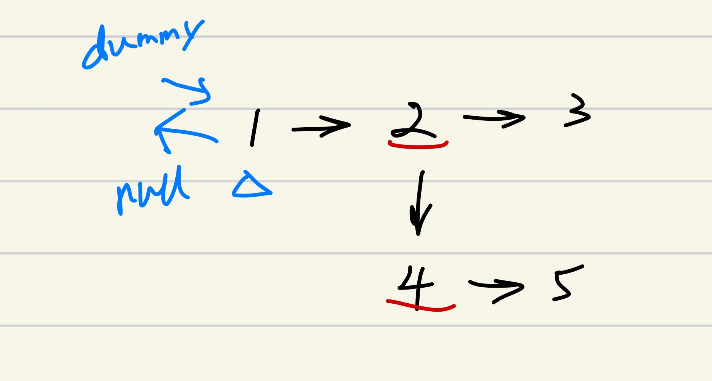

## 剑指 II 028. 展平多级双向链表

### 题目

**src**：https://leetcode-cn.com/problems/Qv1Da2/

#### description

<div align="center">  </div>

#### method signature

```java
public Node flatten(Node head) {
```

### solutions

#### solution 1 (stack iterate)

**扁平化多层数据结构，变成普通的双向链表。**

通过 `child` 属性让链表立体了，我们需要沿着它伸展的方向来扁平它。

利用栈`FILO`的特性，在每一次走到有`子节点`的节点时，把与它相连的下一个节点入栈，这样走完`子链`后，就能退回上一层。

> 因为是 `Deque`，所以 `ArrayDeque` 来做栈，效率比 `Stack` 高；

> **具体实现：**
>
> 遍历时的两种情况，
>
> 1）有 `child`，先和 `child` 连接，再断开 `child` 关系；（连之前要把原先的`next`入栈）
>
> 2）无 `child`，就继续走，直到最后一个，和栈里的`pop()`连上；
>
> 这样就可以展平多层次链表。

<div align="center" >  </div>


> **bonus:**
>
> 题目没说 head 一定不为空，所以考虑一下这个边界情况。


*Code*

```java
/*
// Definition for a Node.
class Node {
    public int val;
    public Node prev;
    public Node next;
    public Node child;
};
*/
class Solution {
    public Node flatten(Node head) {
        // cornor case
        if(head == null) return null;
        
        Deque<Node> q = new ArrayDeque<>();
        Node n = head;
        while(head != null){
            if(head.child != null){
                if(head.next != null) q.push(head.next);
                head.next = head.child;
                head.child.prev = head;
                head.child = null;
            }
            else{
                if(head.next != null) head = head.next;
                else{
                    Node l = head;
                    if(!q.isEmpty()) head = q.pop();
                    else break;
                    l.next = head;
                    head.prev = l;
                }
            }
        }
        return n;
    }
}
```

**Pros and Cons**

| big O            | -    |
| ---------------- | ---- |
| time complexity  | O(n) |
| space complexity | O(n) |

*cons*

额外占用了栈的线性空间。

*pros*

思路清晰。


#### solution 2 (DFS)

**扁平化多层数据结构，变成普通的双向链表。**

用 `DFS` 来扁平化，连接传入 `dfs` 的两个节点，优先走 `child` 节点，以及走完子链后返回到上一层。

> **思路：**
>
> 1. `dummy` 用来返回结果，最后要断开 `dummy` 下一个节点的 `prev` 关系；
> 2. 三个辅助变量：`pre`，`cur`，`hnext`；还有子链的最后一个节点 `tail`；
> 3. `dfs` 方法中，先连接，后断开 `child` 关系；

<div align="center" >  </div>


*Code*

```java
/*
// Definition for a Node.
class Node {
    public int val;
    public Node prev;
    public Node next;
    public Node child;
};
*/
class Solution {
    Node dummy;
    public Node flatten(Node head) {
        // cornor case
        if(head == null) return null;
        
        this.dummy = new Node(-1, null, null, null);
        dfs(dummy, head);
        dummy.next.prev = null;
        return dummy.next;
    }
    private Node dfs(Node pre, Node cur){
        if(cur == null) return pre;
        pre.next = cur;
        cur.prev = pre;
        Node hnext = cur.next;
        Node tail = dfs(cur, cur.child);
        cur.child = null;
        return dfs(tail, hnext);
    }
}
```

**Pros and Cons**

| big O            | -    |
| ---------------- | ---- |
| time complexity  | O(n) |
| space complexity | O(n) |

*cons*

需要维护递归栈。

