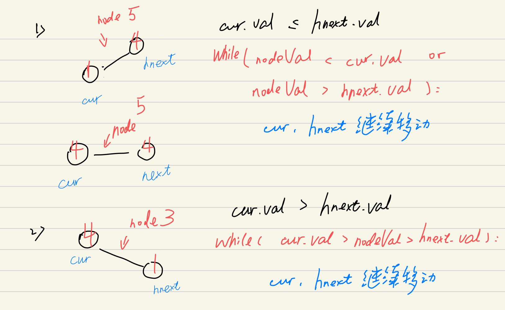

## 剑指 II 029. 排序的循环链表

### 题目

**src**：https://leetcode-cn.com/problems/4ueAj6/

#### description

<div align="center">  </div>

#### method signature

```java
public Node insert(Node head, int insertVal) {
```

### solutions

#### solution 1 (two pointers)

**向排序的循环列表中插入新元素，使该列表仍为循环升序。**

> 插入新元素的操作，题目也给了一个构造方法可以直接用。

<div align="center" >  </div>

> 其实，我们只需要定位插入节点的上一个节点，因为链表本身就是循环升序的。
>
> **因为给定的 head 不一定是最小点，所以会存在递增区域和非递增区域；**
>
> 辅助变量： `cur`，`hnext` 保持移动；
>
> 遍历时的两种情况，
>
> 1） `insertVal` 在一个递增区间内，那么只要`cur.val <= insertVal` or `hnext.val >= insertVal`即可插入到 cur 后面；
>
> 2） `insertVal` 不在递增区间内，即 `cur.val > insertVal > hnext.val`，就不能进行插入；

<div align="center" >  </div>


> **bonus:**
>
> 题目没说 `head` 一定不为空，所以考虑一下这个边界情况：
>
> 此时只需要初始化一个值为 `insertVal` 的 `node`，让它指向自己，之后返回这个循环链表（只包含 `node`）即可。

<div align="center" >  </div>

*Code*

```java
/*
// Definition for a Node.
class Node {
    public int val;
    public Node next;

    public Node() {}

    public Node(int _val) {
        val = _val;
    }

    public Node(int _val, Node _next) {
        val = _val;
        next = _next;
    }
};
*/
class Solution {
    public Node insert(Node head, int insertVal) {
        // cornor case
        if(head == null){
            head = new Node(insertVal);
            head.next = head;
            return head;
        }
        if(head.next == head){
            head.next = new Node(insertVal, head);
            return head;
        }

        Node cur = head;
        Node hnext = head.next;
        while((cur.val <= hnext.val || (insertVal > hnext.val && insertVal < cur.val)) 
              && (cur.val > insertVal || hnext.val < insertVal)){
            cur = hnext;
            hnext = cur.next;
            if(hnext == head) break;
        }
        cur.next = new Node(insertVal, hnext);
        return head;
        
    }
}
```

**Pros and Cons**

| big O            | -    |
| ---------------- | ---- |
| time complexity  | O(n) |
| space complexity | O(1) |

*cons*

有点绕。


#### solution 2 (two pointers)

**向排序的循环列表中插入新元素，使该列表仍为循环升序。**

> 插入新元素的操作，题目也给了一个构造方法可以直接用。

<div align="center" >  </div>

> 辅助变量： `cur`，`hnext` 保持移动；
>
> **遍历时插入的两种情况，**
>
> 1） **一轮中能插入**，`nodeVal` 在 `[min, max]` 区间内，那么只要满足 `cur.val >= node.val >= hnext.val`，就可以插入到 `cur` 后；
>
> 2）  **一轮中不能插入**，`nodeVal` 不在 `[min, max]` 区间内，这时只能插到最后一个 `maxNode` 与 `minNode` 之间，我们需要定位最后一个 `maxNode` 的位置，再进行插入。
>
> * 可以通过 `maxDiff`（其中 `diff = cur.Val - cur.next.Val`） 来确定最后一个 `maxNode` 位置，也可以通过比较，来不断更新 `maxNode` 和 `minNode` 来确定位置；

<div align="center" >  </div>


*Code*

```java
/*
// Definition for a Node.
class Node {
    public int val;
    public Node next;

    public Node() {}

    public Node(int _val) {
        val = _val;
    }

    public Node(int _val, Node _next) {
        val = _val;
        next = _next;
    }
};
*/
class Solution {
    public Node insert(Node head, int insertVal) {
        Node node = new Node(insertVal);

        // cornor case
        if(head == null){
            node.next = node;
            head = node;
            return head;
        }

        Node cur = head;
        Node hnext = head.next;
        Node maxNode = head;
        Node minNode = head.next;
        do{
            if(cur.val <= insertVal && hnext.val >= insertVal){
                cur.next = node;
                node.next = hnext;
                return head;
            }
            if(cur.val > hnext.val){
                maxNode = cur;
                minNode = hnext;
            }
            cur = cur.next;
            hnext = hnext.next;
        }while(cur != head);
        maxNode.next = node;
        node.next = minNode;
        return head;
    }
}
```

**Pros and Cons**

| big O            | -    |
| ---------------- | ---- |
| time complexity  | O(n) |
| space complexity | O(1) |


*pros*

思路清晰。
