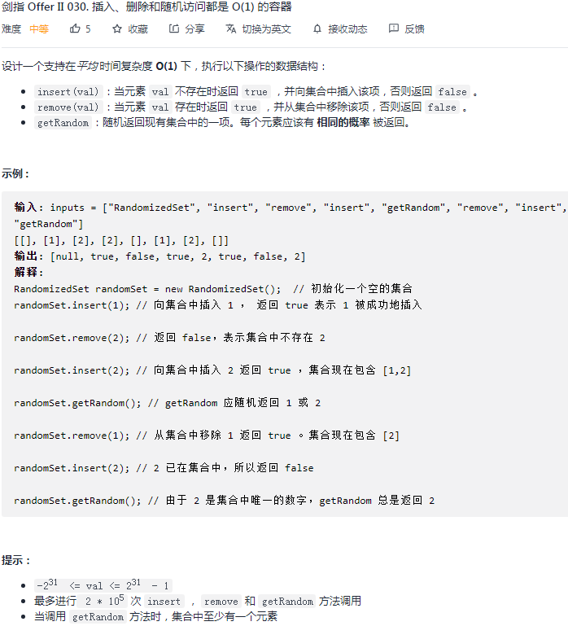

## 剑指 II 030. 插入、删除和随机访问都是 O(1) 的容器

### 题目

**src**：https://leetcode-cn.com/problems/FortPu/

#### description

<div align="center">  </div>

#### method signatures

```java
class RandomizedSet {
    public RandomizedSet() {}
    public boolean insert(int val) {}
    public boolean remove(int val) {}
    public int getRandom() {}
}
```

### solutions

#### solution 1 (设计-使用hashtable)

**实现一个 RandomizedSet 类，其中有 insert(val), remove(val), getRandom() 方法。**

*time complexity 都要是 O(1);*

> **boolean insert(val)** 
>
> `val` 已存在，返回 `false`；
>
> `val` 不存在，`insert val`，返回 `true`；
>
> *hashtable map 的 key, value 分别对应 val, index，用来快速定位 val 在 ArrayList arr 中的位置；*

```txt
insert(val):
	if(map 包含 val): -> F;
	
	arr 添加 val;
	更新 map 中 val 相关映射: val -- arr 最后一个元素的 index;
	-> T;
```

> **boolean remove(val)** 
>
> `val` 不存在，无法删除没有的元素，返回 `false`；
>
> `val` 存在，借助 `map`，得到它对应的 `index`，`delete val`，返回 `true`。
>
> * 这样 `arr` 会有空位置，之后 `getRandom()` 时，概率会不均，所以，我们通过**覆盖法**来删，把原本在 `arr` 末尾的元素放到 `val` 的位置，并在 `map` 中更新它，之后便可以删掉 `arr` 的最后一个元素， 这时已经 “删掉” 了 `val`，所以 `map` 也需要更新，即删掉 `val` 的相关映射。

```txt
remove(val):
	if(map 不包含 val): -> F;
	
	覆盖法，最后一个覆盖 val，并更新最后一个元素对应的 map;
	删掉 arr 最后一个元素，并删掉 val 对应的 map;
	-> T;
```

> **int getRandom()** 
>
> 随机返回数组中已有的元素；

```txt
getRandom():
	随机区间是 arr 的大小
```

 `public int nextInt(int bound)` 左开右闭；

[调用 Random 接口]: https://docs.oracle.com/javase/8/docs/api/java/util/Random.html	"Class Random - Java 8"


*Code*

```java
class RandomizedSet {
    private HashMap<Integer, Integer> map;
    private ArrayList<Integer> arr;
    private Random random;

    /** Initialize your data structure here. */
    public RandomizedSet() {
        map = new HashMap<>();
        arr = new ArrayList<>();
        random = new Random();
    }
    
    /** Inserts a value to the set. Returns true if the set did not already contain the specified element. */
    public boolean insert(int val) {
        if(map.containsKey(val)) return false;
        arr.add(val);
        map.put(val, arr.size() - 1);
        return true;
    }
    
    /** Removes a value from the set. Returns true if the set contained the specified element. */
    public boolean remove(int val) {
        if(!map.containsKey(val)) return false;
        Integer index = map.get(val);
        Integer lastEle = arr.get(arr.size() - 1);
        arr.set(index, lastEle);
        map.put(lastEle, index);
        arr.remove(arr.size() - 1);
        map.remove(val);
        return true;
    }
    
    /** Get a random element from the set. */
    public int getRandom() {
        return arr.get(random.nextInt(arr.size()));
    }
}

/**
 * Your RandomizedSet object will be instantiated and called as such:
 * RandomizedSet obj = new RandomizedSet();
 * boolean param_1 = obj.insert(val);
 * boolean param_2 = obj.remove(val);
 * int param_3 = obj.getRandom();
 */
```

**Pros and Cons**

| big O            | -    |
| ---------------- | ---- |
| time complexity  | O(1) |
| space complexity | O(1) |

