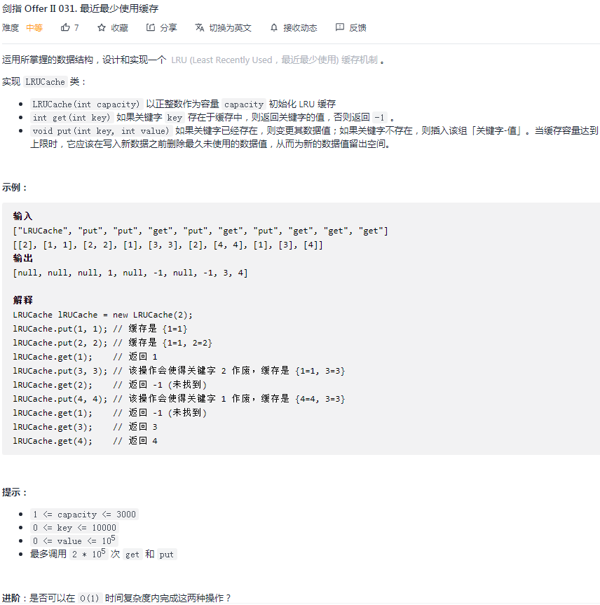
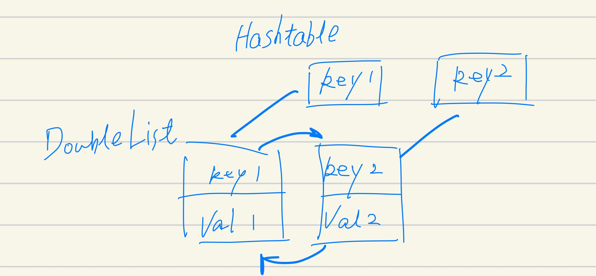
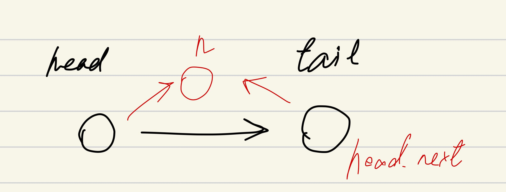

## 剑指 II 031. 最近最少使用缓存

### 题目

**src**：https://leetcode-cn.com/problems/OrIXps/

#### description

<div align="center">  </div>

#### method signatures

```java
class LRUCache {
    public LRUCache(int capacity) {}
    public int get(int key) {} 
    public void put(int key, int value) {}
}
```

### solutions

#### solution 1 (设计-使用hashtable，doubly linkedlist)

**实现一个 LRUCache 类，其中有 get(key), put(key, val) 方法， put 超过 capacity 就删除 least recently used 的元素。**

*time complexity 都要是 O(1);*

> 根据以上，我们发现 `LRUcache` 需要满足：查找快，插入快，删除快，且有顺序。（数据结构见下图）
>
> * 看到 `get(key)`，自然联想到用 `hashtable` 来关联 `key` 和 `val`，实现快速查找。
>
> * 每次访问完，要把数据插到队头，快速插入用`链表`来实现。
>
> * 放数据也是头插法，因为过载需要删除数据，所以用 `doubly linkedlist`，方便操作 `prev`，直接用前一个指向后一个来跳过当前数据。
>
> **需要注意的是：**
>
> 链表中存的是 `<key, val>` 键值对，不是单一的 `val`，因为链表中删掉不需要的元素后，在 `map` 中也要同步删掉，这时就需要通过链表中的 `key` 来定位 `map` 的 `key`。

<div align="center" >  </div>


首先，构建 `doubly linkedlist` 的`节点类`：

```java
class Node{
    Node prev, next;
    int key, val;
    // constructor
    Node(int k, int v){
        this.key = k;
        this.val = v;
    }
}
```

然后，依照节点构建一个 `doubly linkedlist`：

```java
class DoublyLinkedlist{
    void addFirst(Node x); // 链表头插，time complexity O(1)
    void remove(Node x); // 删除 Node x（x 一定存在），time complexity O(1)
    Node removeLast(); // 删除链表最后一个节点，并返回该节点，time complexity O(1)
    int size(); // 返回链表长度，通过增加、减少节点时候的 tracking，time complexity O(1)
}
```

之后，把 `doubly linkedlist` 与 `hashtable` 结合，就可以实现 `LRUCache`：

```txt
HashMap<Integer, Node> map;
DoublyLinkedlist cache;
int capacity;

int get(int key):
	if(map 中不包含 key)： -> -1;
	
	查 map 得到 <key, val> 的 val，头插<key, val>; // 保证顺序
	-> val;

void put(int key, int val):
	Node x = new Node(key, val);
	if(map 中已包含 key):
		删除旧的 Node x，头插新的 Node x; // 保证顺序
		更新 map; // 因为 Node x 的 val 可能变了
	else:
		if(cache == capacity):
			删除链表最后一个节点，并返回该节点，map 也同步删掉这个 key;
		头插 Node x，更新 map;
```

> **bonus:**
>
> `DoublyLinkedlist` 具体实现，头插如下图。

<div align="center" >  </div>


*Code*

```java
class LRUCache {
    private class Node{
        Node prev, next;
        int key, val;
        private Node(int k, int v){
            this.key = k;
            this.val = v;
        }
    }
    private class DoubleList{
        Node head = new Node(0, 0);
        Node tail = new Node(0, 0);
        int size;
        private DoubleList(){
            head.next = tail;
            tail.prev = head;
            size = 0;
        }
        private void addFirst(Node node){
            Node hnext = head.next;
            head.next = node;
            hnext.prev = node;
            node.prev = head;
            node.next = hnext;
            size++;
        }
        private void remove(Node node){
            node.prev.next = node.next;
            node.next.prev = node.prev;
            size--;
        }
        private Node removeLast(){
            Node last = tail.prev;
            remove(last);
            return last;
        }
        private int size(){
            return size;
        }
    }

    private HashMap<Integer, Node> map;
    private DoubleList cache;
    private int capacity;

    public LRUCache(int capacity) {
        this.capacity = capacity;
        map = new HashMap<>(capacity);
        cache = new DoubleList();
    }
    
    public int get(int key) {
        if(!map.containsKey(key)) return -1;
        int val = map.get(key).val;
        put(key, val);
        return val;
    }
    
    public void put(int key, int val) {
        Node x = new Node(key, val);
        if(map.containsKey(key)){
            cache.remove(map.get(key));
            cache.addFirst(x);
            map.put(key, x);
        }else{
            if(cache.size() == capacity){
                // Node last = cache.removeLast();
                // map.remove(last.key);
                map.remove(cache.removeLast().key);
            }
            cache.addFirst(x);
            map.put(key, x);
        }
    }
}

/**
 * Your LRUCache object will be instantiated and called as such:
 * LRUCache obj = new LRUCache(capacity);
 * int param_1 = obj.get(key);
 * obj.put(key,value);
 */
```

**Pros and Cons**

| big O           | -    |
| --------------- | ---- |
| time complexity | O(1) |


#### solution 2 (设计-调 LinkedHashMap)

> **参考 Java 8：**https://docs.oracle.com/javase/8/docs/api/java/util/LinkedHashMap.html
>
> **参考题解：**https://leetcode-cn.com/problems/lru-cache/solution/yuan-yu-linkedhashmapyuan-ma-by-jeromememory/

*Code*

```java
class LRUCache extends LinkedHashMap<Integer, Integer>{
    private int capacity;

    public LRUCache(int capacity) {
        super(capacity, 0.75F, true);
        this.capacity = capacity;
    }
    
    public int get(int key) {
        return super.getOrDefault(key, -1);
    }
    
    public void put(int key, int value) {
        super.put(key, value);
    }

    @Override
    protected boolean removeEldestEntry(Map.Entry<Integer, Integer> eldest){
        return size() > capacity;
    }
}

/**
 * Your LRUCache object will be instantiated and called as such:
 * LRUCache obj = new LRUCache(capacity);
 * int param_1 = obj.get(key);
 * obj.put(key,value);
 */
```

**Pros and Cons**

| big O           | -    |
| --------------- | ---- |
| time complexity | O(1) |

