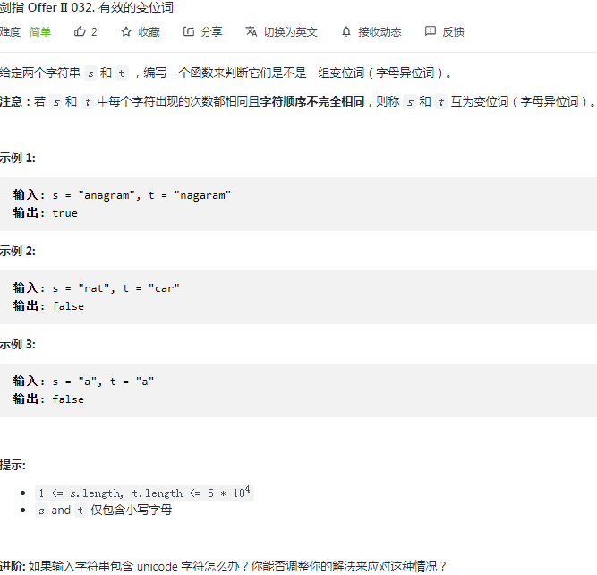

## 剑指 II 032. 有效的变位词

### 题目

**src**：https://leetcode-cn.com/problems/dKk3P7/

#### description

<div align="center">  </div>

#### method signature

```java
public boolean isAnagram(String s, String t) {
```

### solutions

#### solution 1 (hashtable)

**判断 s 和 t 是不是变位词。**

变位词：每个字符的出现次数相同，但是顺序不完全相同。

> `hashtable map` 存键值对 <出现字符，次数>，
>
> 1）可以通过 2 个表分别记 `s` 和 `t`，最后看是否 `equals` 来确定；
>
> 2）也可以 1 个表先记 `s`，之后读 `t` 的时候一一减去，通过**先读再减**实现加速，
>
> ​		1.如果读到 `s` 中没有的字符
>
> ​		2.或者这个字符还没减次数就已是 `0` 了
>
> ​	那么这种情况 `s` 和 `t` 必然不是变位词；


> **bonus:**
>
> 题目中说 `s` 和 `t` 中都是小写字母，把小写字母转化为 0-25 的数字是可行的，这样就可以用数组实现（下标作为`key`，指代出现字符），节约一些常数空间。
>
> 但是进阶版本是 `unicode` 字符，就还是用 `hashtable` 实现。
>
> **cornor case 的讨论：**
>
> 题目中没有说 `s` 和 `t` 的长度相等，这个情况需要考虑；
>
> 题目中也没有说 `s` 和 `t` 不会等价，这个情况需要考虑；


##### *Code 1 （2 个 hashtable）*

```java
class Solution {
    public boolean isAnagram(String s, String t) {
        // cornor case
        if(s.length() != t.length() || s.equals(t)) return false;

        HashMap <Integer, Integer> mapS = new HashMap<>(26);
        HashMap <Integer, Integer> mapT = new HashMap<>(26);
        for(int i = 0; i < s.length(); i++){
            int cur = s.charAt(i) - 'a';
            mapS.put(cur, mapS.getOrDefault(cur, 0) +1);
        }
        for(int j = 0; j < t.length(); j++){
            int cur = t.charAt(j) - 'a';
            mapT.put(cur, mapT.getOrDefault(cur, 0) +1);
        }
        // if(mapS.equals(mapT)) return true;
        // return false;
        return mapS.equals(mapT);
    }
}
```

##### *Code 2 （1 个 hashtable）*

```java
class Solution {
    public boolean isAnagram(String s, String t) {
        // cornor case
        if(s.length() != t.length() || s.equals(t)) return false;

        HashMap <Integer, Integer> map = new HashMap<>(26);
        for(int i = 0; i < s.length(); i++){
            int cur = s.charAt(i) - 'a';
            map.put(cur, map.getOrDefault(cur, 0) +1);
        }
        for(int j = 0; j < t.length(); j++){
            int cur = t.charAt(j) - 'a';
            Integer count = map.getOrDefault(cur, 0);
            if(count == 0) return false;
            map.put(cur, count - 1);
        }
        return true;
    }
}
```

**Pros and Cons**

| big O            | -              |
| ---------------- | -------------- |
| time complexity  | O(n)           |
| space complexity | O(1)，常数空间 |


