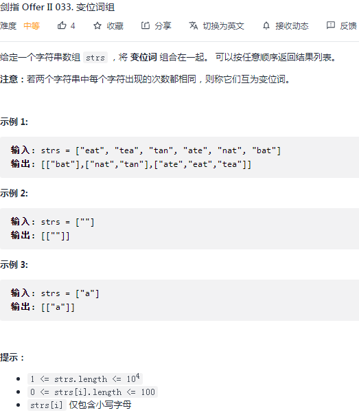

## 剑指 II 033. 变位词组

### 题目

**src**：https://leetcode-cn.com/problems/sfvd7V/

#### description

<div align="center">  </div>

#### method signature

```java
public List<List<String>> groupAnagrams(String[] strs) {
```

### solutions

#### solution 1 (hashtable)

**找到变位词后，将变位词组合在一起。**

变位词：每个字符的出现次数相同，但是顺序不完全相同。

> abc、bca，这样的变位词进行升序排列，都将会是 abc；
>
> `hashtable map` 存键值对 <变位词排序后形成的字符串，对应变位词组成的数组>，举例：<"abc", ["abc", "cba"]>；
>
> 先排序，之后一一存入 map，最后输出 map 中所有的数组（放到一个大数组里套娃）即可；
>
> * 调用 HashMap 的 values() 接口，导出 map 的 collection 视图。


> **bonus:**
>
> 字符串内部的字符排序可以调用 Arrays 类的 sort() 接口，原理是快排，也可以手写快排。
>
> 变位词排序后形成的字符串，
>
> ​	可以通过 String 类的 valueOf() 接口，得到这个 char 数组的 String representation，
>
> ​	也可以通过 String 类的构造方法 String(char[] value) 来得到。


##### *Code 1 （调接口）*

```java
class Solution {
    public List<List<String>> groupAnagrams(String[] strs) {
        HashMap<String, ArrayList<String>> map = new HashMap<>();
        for(String str : strs){
            char[] arr = str.toCharArray();
            Arrays.sort(arr);
            String s = String.valueOf(arr);
            // String s = new String(arr);
            ArrayList<String> list = map.getOrDefault(s, new ArrayList<>());
            list.add(str);
            map.put(s, list);
        }
        return new ArrayList<>(map.values());
    }
}
```

##### *Code 2 （手写快排）*

```java
class Solution {
    public List<List<String>> groupAnagrams(String[] strs) {
        HashMap<String, ArrayList<String>> map = new HashMap<>();
        for(String str : strs){
            char[] arr = str.toCharArray();
            // Arrays.sort(arr);
            quickSort(arr, 0, arr.length - 1);
            String s = String.valueOf(arr);
            // String s = new String(arr);
            ArrayList<String> list = map.getOrDefault(s, new ArrayList<>());
            list.add(str);
            map.put(s, list);
        }
        return new ArrayList<>(map.values());
    }

    private void quickSort(char[] chars, int startIndex, int endIndex){
        if(startIndex >= endIndex) return;
        int pivot = partition(chars, startIndex, endIndex);
        quickSort(chars, startIndex, pivot - 1);
        quickSort(chars, pivot + 1, endIndex);
    }

    private int partition(char[] chars, int startIndex, int endIndex){
        int pivot = endIndex;
        int mark = startIndex;
        for(int i = startIndex; i < endIndex; i++){
            if(chars[i] < chars[pivot]){
                if(mark != i) swap(chars, mark, i);
                mark++;
            }
        }
        swap(chars, mark, pivot);
        return mark;
    }
    
    private void swap(char[] chars, int index1, int index2){
        char tmp = chars[index1];
        chars[index1] = chars[index2];
        chars[index2] = tmp;
    }
}
```

**Pros and Cons**

| big O            | -                                                      |
| ---------------- | ------------------------------------------------------ |
| time complexity  | n 为 strs[i].length，m 为 strs.length，O(m * nlogn)    |
| space complexity | O(mn)，原来放 strs 中的需要都放到 map 中，所占用的空间 |


