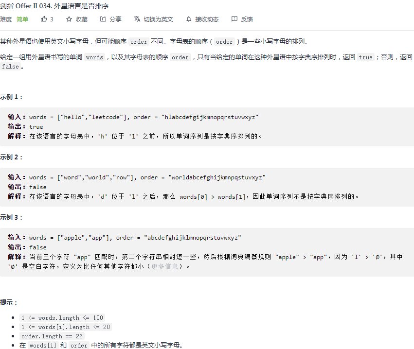

## 剑指 II 034. 外星语言是否排序

### 题目

**src**：https://leetcode-cn.com/problems/lwyVBB/

#### description

<div align="center">  </div>

#### method signature

```java
public boolean isAlienSorted(String[] words, String order) { 
```

### solutions

#### solution 1 (hashtable)

**判断 words 是否按 order 排列。**

用 hashtable 保存 order 中各个字符对应的字典序，键值对<字母，对应字典序>；

> **需要注意的是：**
>
> 一长一短的两个 word，比如 abb，ab，空白字符最小，所以 ab 应该在前，那么我们在对比的时候，先确定短字符串的长度 min，遍历完 min 后，**看在前的是不是较长的字符串**，如果`在前`且还没有得到`相同位置后一个字符串比前一个字符串大`，那就不符合 order。

在遍历过程中，要分开讨论：（记 dif 为`当前字母的order - 前一个字母的order`）

```txt
if(dif > 0):
	flag = true; // 标记这两个 word 已经符合 order
	break; // 遍历下一个
if(dif == 0): 
	continue;
if(dif < 0): -> false
```

##### *Code*

```java
class Solution {
    public boolean isAlienSorted(String[] words, String order) { 
        HashMap<Character, Integer> map = new HashMap<>(26);
        for(int i = 0; i < 26; i++){
            map.put(order.charAt(i), i);
        }
        for(int i = 1; i < words.length; i++){
            int min = Math.min(words[i - 1].length(), words[i].length());
            boolean flag = false;
            for(int j = 0; j < min; j++){
                int dif = map.get(words[i].charAt(j)) - map.get(words[i - 1].charAt(j));
                if(dif < 0) return false;
                else if(dif == 0) continue;
                else{
                    flag = true;
                    break;
                }
            }
            if(!flag && words[i - 1].length() > min) return false;
        }
        return true;
    }
}
```

**Pros and Cons**

| big O            | -                                              |
| ---------------- | ---------------------------------------------- |
| time complexity  | n 为 words[i].length，m 为 words.length，O(mn) |
| space complexity | O(1)，常数空间                                 |


