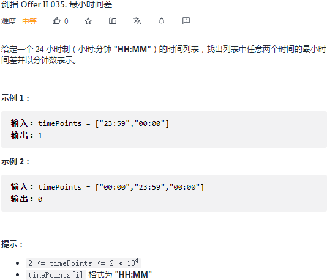

## 剑指 II 035. 最小时间差

### 题目

**src**：https://leetcode-cn.com/problems/569nqc/

#### description

<div align="center">  </div>

#### method signature

```java
public int findMinDifference(List<String> timePoints) {
```

### solutions

#### solution 1 (hashtable)

**找出最小时间差，并以分钟形式表示。**

> **21:03，22:01 都是 24小时制 HH:MM，把它们转化为分钟制：**
>
> * 调用 `String` 类的 `split(String regex)` 接口，把一个时间点转化为字符串数组，比如 `["21", "03"]`；
> * 之后，进行分钟制的换算，调用 `Integer` 类的 `valueOf(String s)`  接口，得到一个 `Integer` 对象，之后计算即可。

> **实现思路：**
>
> 遍历字符串数组 `timePoints`，转化为分钟制，放入新的数组 `minutes`，升序排列，之后一一计算差值，得到最小差值返回。
>
> 计算差值前，`minutes` 最后放入元素`最小时间点追加 24h`。

> **需要注意：**
>
> 时间点是双向的，
>
> 给定 `21:03`，`01:00` 两个时间点，最小时间差是 `21:03` 至午夜 1 点，就是要给 `01:00` 加上完整的 `24h`，让它变成第二天早上，这样就可以减去第一天的 `21:03` 了；
>
> 给定 `01:03`，`01:00` 两个时间点，最小时间差是凌晨 1 点至 `01:03`，这时可以直接相减；
>
> 所以，我们要将最小时间点追加 24h。

> **cornor case 的讨论：**
>
> 一天有 `60 * 24` 分钟，如果 `timePoint` 数组长度超过了 `60 * 24`，那么肯定有重复的时间点，直接得到最小时间差为 0；
>
> **bonus：**
>
> 数组 `minutes` 的排序可以调用 `ArrayList` 类的 `sort(Comparator<? super E> c)` 接口，也可以调用 `Collections` 类的 `sort(List<T> list)` 接口，也可以手写快排。


##### *Code 1 （调接口）*

```java
class Solution {
    public int findMinDifference(List<String> timePoints) {
        // cornor case
        if(timePoints.size() > 24 * 60) return 0;
        
        ArrayList<Integer> minutes = new ArrayList<>(timePoints.size() + 1);
        for(String time : timePoints){
             minutes.add(getMinutes(time));
        }
        minutes.sort(Comparator.naturalOrder());
        // Collections.sort(minutes);
        minutes.add(minutes.get(0) + 24 * 60);
        // int ans = 24 * 60;
        int ans = Integer.MAX_VALUE;
        for(int i = 1; i < minutes.size(); i++){
            ans = Math.min(ans, minutes.get(i) - minutes.get(i - 1));
        }
        return ans;
    }
    private int getMinutes(String s){
        String[] nums = s.split(":");
        return Integer.valueOf(nums[0]) * 60 + Integer.valueOf(nums[1]) * 1;
    }
}
```


##### *Code 2 （手写快排）*

```java
class Solution {
    public int findMinDifference(List<String> timePoints) {
        // cornor case
        if(timePoints.size() > 24 * 60) return 0;
        
        ArrayList<Integer> minutes = new ArrayList<>(timePoints.size() + 1);
        for(String time : timePoints){
             minutes.add(getMinutes(time));
        }
        quickSort(minutes, 0, minutes.size() - 1);
        // minutes.sort(Comparator.naturalOrder());
        // Collections.sort(minutes);
        minutes.add(minutes.get(0) + 24 * 60);
        int ans = Integer.MAX_VALUE;
        for(int i = 1; i < minutes.size(); i++){
            ans = Math.min(ans, minutes.get(i) - minutes.get(i - 1));
        }
        return ans;
    }

    private int getMinutes(String s){
        String[] nums = s.split(":");
        return Integer.valueOf(nums[0]) * 60 + Integer.valueOf(nums[1]) * 1;
    }

    private void quickSort(ArrayList<Integer> arr, int startIndex, int endIndex){
        if(startIndex >= endIndex) return;
        int pivot = partition(arr, startIndex, endIndex);
        quickSort(arr, startIndex, pivot - 1);
        quickSort(arr, pivot + 1, endIndex);
    }

    private int partition(ArrayList<Integer> arr, int startIndex, int endIndex){
        int pivot = endIndex;
        int mark = startIndex;
        for(int i = startIndex; i < endIndex; i++){
            if(arr.get(i) < arr.get(pivot)){
                if(mark != i) swap(arr, mark, i);
                mark++;
            }
        }
        swap(arr, mark, pivot);
        return mark;
    }
    
    private void swap(ArrayList<Integer> arr, int index1, int index2){
        Integer tmp = arr.get(index1);
        arr.set(index1, arr.get(index2));
        arr.set(index2, tmp);
    }
}
```

**Pros and Cons**

| big O            | -                               |
| ---------------- | ------------------------------- |
| time complexity  | O(nlogn), n = timePoints.length |
| space complexity | O(n)                            |


